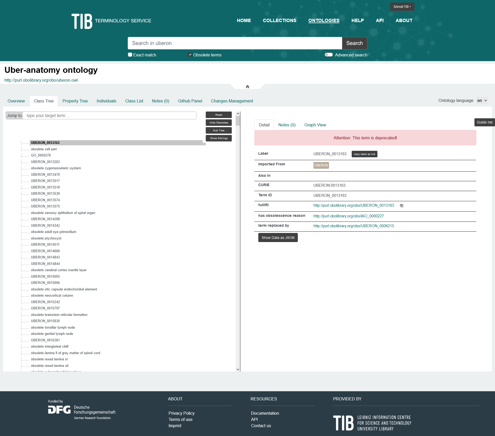

# Ontology metadata recommendations by TIB

Document status: **DRAFT**

Modification date: 2025-06-30

Creators and contributors:

<!-- * [Last name, First Name  (Affiliation)](https://orcid.org/) -->
* [Arndt, Susanne  (Technische Informationsbibliothek)](https://orcid.org/0000-0002-1019-9151)
* [Ganske, Anette  (Technische Informationsbibliothek)](https://orcid.org/0000-0003-1043-4964)
* [Hauschke, Christian  (Technische Informationsbibliothek)](https://orcid.org/0000-0003-2499-7741)
* [Strömert, Philip  (Technische Informationsbibliothek)](https://orcid.org/0000-0002-1595-3213)
* [Vogt, Lars (Technische Informationsbibliothek)](https://orcid.org/0000-0002-8280-0487)

License: [CC BY 4.0 Deed Attribution 4.0 International](https://creativecommons.org/licenses/by/4.0/)

Zenodo archive: <https://doi.org/10.5281/zenodo.11103070>

<div style="page-break-after: always;"></div>

## Table of contents

[0 Executive summary](#0-executive-summary)

[1 Why Ontology Metadata?](#1-introduction)

* [1.1 How to provide ontology metadata](#11-how-to-provide-ontology-metadata)
* [1.2 Why ontology metadata?](#12-why-ontology-metadata)

[2 How to read this document](#2-how-to-read-this-document)

* [2.1 Chapter structure and wording](#21-chapter-structure-and-wording)
* [2.2 Metadata recommendations and SHACL](#22-metadata-recommendations-and-shacl)
  * [2.2.1 Ontology-level metadata](#221-ontology-level-metadata)
  * [2.2.2 Term-level metadata](#222-term-level-metadata)
* [2.3 Prefixes used in this document](#23-prefixes-used-in-this-document)
* [2.4 Acronyms](#24-acronyms)

[3 Ontology-level metadata](#3-ontology-level-metadata)

* [3.1 Mandatory Metadata](#31-mandatory-metadata)
  * [3.1.1 Ontology title](#311-ontology-title)
  * [3.1.2 Preferred ontology prefix/ acronym](#312-preferred-ontology-prefix-acronym)
  * [3.1.3 Ontology license](#313-ontology-license)
  * [3.1.4 Ontology creator(s)](#314-ontology-creators)
  * [3.1.5 Ontology version IRI](#315-ontology-version-iri)
  * [3.1.6 Ontology creation date](#316-ontology-creation-date)
  * [3.1.7 Ontology abstract](#317-ontology-abstract)
  * [3.1.8 Ontology issue tracker](#318-ontology-issue-tracker)
  * [3.1.9 Ontology documentation](#319-ontology-documentation)
* [3.2 Recommended Metadata](#32-recommended-metadata)
  * [3.2.1 Ontology contributor(s)](#321-ontology-contributors)
  * [3.2.2 Ontology funder](#322-ontology-funder)
  * [3.2.3 Ontology funding](#323-ontology-funding)
  * [3.2.4 Ontology audience description](#324-ontology-audience-description)
  * [3.2.5 Ontology subject(s)](#325-ontology-subjects)
  * [3.2.6 Ontology annotation language(s)](#326-ontology-annotation-languages)
  * [3.2.7 Applied logical framework](#327-applied-logical-framework)
  * [3.2.8 Ontology serialization/ file format](#328-ontology-serialization-file-format)
  * [3.2.9 Ontology status](#329-ontology-status)
  * [3.2.10 Ontology code repository](#3210-ontology-code-repository)
  * [3.2.11 Ontology distributions/ products](#3211-ontology-distributions-products)
  * [3.2.12 Application example](#3212-application-example)
  * [3.2.13 Related resource(s)](#3213-related-resources)
  * [3.2.14 Citation suggestion](#3214-citation-suggestion)
  * [3.2.15 Ontology sources (derived from)](#3215-ontology-sources-derived-from)
  * [3.2.16 Ontology root classes](#3216-ontology-root-classes)
* [3.3 Optional Metadata](#33-optional-metadata)
  * [3.3.1 Ontology description](#331-ontology-description)
  * [3.3.2 Alternative ontology title](#332-alternative-ontology-title)
  * [3.3.3 Alternative ontology prefix/ acronym](#333-alternative-ontology-prefix-acronym)
  * [3.3.4 Related version/ version history](#334-related-version-version-history)
    * [3.3.4.1 Prior ontology version](#3341-prior-ontology-version)
    * [3.3.4.2 Related ontology version](#3342-related-ontology-version)
    * [3.3.4.3 Compatible ontology version](#3343-compatible-ontology-version)
    * [3.3.4.4 Incompatible ontology version](#3344-incompatible-ontology-version)
  * [3.3.5 Social media](#335-social-media)
  * [3.3.6 KOS type](#336-kos-type)
  * [3.3.7 Example ontology identifier](#337-example-ontology-identifier)
  * [3.3.8 Ontology identifier pattern](#338-ontology-identifier-pattern)
  * [3.3.9 Ontology homepage](#339-ontology-homepage)
  * [3.3.10 Ontology publisher](#3310-ontology-publisher)
  * [3.3.11 Ontology comments](#3311-ontology-comments)
  * [3.3.12 Example ontology class](#3312-example-ontology-class)
  * [3.3.13 Ontology mailing list](#3313-ontology-mailing-list)
  * [3.3.14 Ontology logo/ depictions/ related visualization](#3314-ontology-logo-depiction-related-visualizations)
  * [3.3.15 Alternative identifiers of the ontology](#3315-alternative-identifiers-of-the-ontology)
  * [3.3.16 Development environment](#3316-development-environment)
  * [3.3.17 Alignments/ mappings](#3317-alignments-mappings)
    * [3.3.17.1 Aligned resources](#33171-aligned-resources)
    * [3.3.17.2 Alignment files/ mapping files](#33172-alignment-files-mapping-files)
  * [3.3.18 Competency questions](#3318-competency-questions)
  * [3.3.19 Applied methodology](#3319-applied-methodology)
  * [3.3.20 Preferred ontology namespace](#3320-preferred-ontology-namespace)
  * [3.3.21 Ontology issue date](#3321-ontology-issue-date)
  * [3.3.22 Modification date](#3322-modification-date)
  * [3.3.23 Textual version information](#3323-textual-version-information)
  * [3.3.24 Version notes](#3324-version-notes)
* [3.4 Tabular overview - recommendations](#34-tabular-overview)
* [3.5 Relations to related work](#35-relations-to-related-work)

[4 Term-level Metadata](#4-term-level-metadata)

* [4.1 Mandatory metadata](#41-mandatory-term-level-metadata)
  * [4.1.1 Preferred label](#411-term-level-metadata---preferred-label)
  * [4.1.2 Definition](#412-term-level-metadata---definition)
    * [4.1.2.1 Definition source](#4121-term-level-metadata---definition-source)
  * [4.1.3 Term deprecation/ obsoletion](#413-term-level-metadata---term-deprecation-obsoletion-mandatory-only-if-applicable)
    * [4.1.3.1 Deprecation marker](#4131-term-level-metadata---deprecation-marker-mandatory-only-if-applicable)
    * [4.1.3.2 Obsoletion reason](#4132-term-level-metadata---obsoletion-reason-mandatory-only-if-applicable)
    * [4.1.3.3 Term replacement](#4133-term-level-metadata---term-replacement-mandatory-only-if-applicable)
* [4.2 Recommended metadata](#42-recommended-term-level-metadata)
  * [4.2.1 Synonyms/ alternative labels](#421-term-level-metadata---synonyms-alternative-labels)
  * [4.2.2 Date modified](#422-term-level-metadata---date-modified)
  * [4.2.3 Editor note](#423-term-level-metadata---editor-note)
  * [4.2.4 Term tracker item](#424-term-level-metadata---term-tracker-item)
* [4.3 Optional metadata](#43-optional-term-level-metadata)
  * [4.3.1 Term editor](#431-term-level-metadata---term-editor-term-contributors)
  * [4.3.2 Example of usage](#432-term-level-metadata---example-of-usage)
  * [4.3.3 Defined by](#433-term-level-metadata---defined-by)
  * [4.3.4 Comments](#434-term-level-metadata---comments)
* [4.4 Tabular overview - recommendations](#44-tabular-overview---recommendations)
* [4.5 Relations to related work](#45-relations-to-related-work)

[5 Sources](#5-sources)

<div style="page-break-after: always;"></div>

## 0. Executive summary

The number of ontology registries, archives and catalogues has increased over time. There are multiple services that list and also index ontologies. The registry entries of such services usually require the metadata of the ontologies they index, in order to make the ontologies findable and to provide users with general introductory information about the ontologies and their reuse. Registries currently face several problems, though:

* It is not yet standard procedure to provide rich ontology metadata despite efforts towards increasing the FAIRness of semantic resources [[1]](#source1), [[2]](#source2), in particular legacy ontologies may not be updated with rich metadata.
* Metadata may be provided in unstructured form outside of the ontology source which makes their collection difficult.
* Different registries may provide structured, open metadata documents for the same ontology which may at some point become incongruous with the source data.
* Currently, no standard metadata schema for ontologies exists.

In order to avoid these problems, metadata management should be part of the ontology engineering process: The metadata of an ontology should be part of the ontology's code base or the ontology itself. This would make the ontology resp. its code base the single source of truth for its own metadata.

It is therefore mandatory that an ontology provides its own metadata with machine-understandable semantics and established terms from metadata ontologies and controlled vocabularies. The metadata need to be as or even more persistent than the ontology itself. [Principle R1][FAIR Principles R1] of the FAIR principles [[1]](#source2) furthermore recommends to not just provide metadata that allow the discovery of an ontology (e.g. title, ontology prefix, authors), but to add metadata that richly describe the contents of the ontology and the conditions of its creation and use (cf. [1.2 Why ontology metadata?](#12-why-ontology-metadata)).

With this document, *TIB - Leibniz Information Centre for Science and Technology University Library* provides a practical guide for metadata management of ontologies. It gives recommendations on required, recommended and optional metadata for ontologies. As there are currently several recommendations available (cf. [[13]](#source13), [[14]](#source14), [[15]](#source15), [[16]](#source16), [[17]](#source17), [[18]](#source18), [[19]](#source19), [[20]](#source20), [[21]](#source21), [[22]](#source22), [[23]](#source23)), this guide will provide recommendations on ontology metadata that particularly adress the publishing of ontologies on the [TIB Terminology Service][TIB TS].

In addition, we provide shapes for SHACL validators based on these recommendations (cf. [2.2 Metadata recommendations and SHACL](#22-metadata-recommendations-and-shacl)).

## 1 Introduction

### 1.1 How to provide ontology metadata?

Ontology metadata must be provided in a machine-understandable format. We therefore recommend to provide them as a part of the ontology itself: The metadata should be statements about the ontology that use dedicated annotation, object or data properties, to guarantee a good level of granularity and distinguishability of the metadata.

If you provide metadata that are here considered as *recommended* or *optional* in a single file, you may add a statement using rdfs:seeAlso to point to that document. Ideally, this document should then be etrievable with a persistent identifier (PID) - e.g. a DOI or a PURL. However, we do not recommend this, especially if that document is not machine-understandable.

### 1.2 Why ontology metadata?

Providing rich, machine-understandable metadata for an ontology has many advantages for their users (cf. [[1]](#source1), [[2]](#source2)), e.g.:

* They give a rich description about the ontology including its provenance, scope and purpose.
* They allow automatic extraction and indexing of the ontology by different services and reduce the effort of manual curation.
* They enable others to reuse the ontology or its terms and apply them for their own purposes.
* They indicate the current status of an ontology, distinguishing whether an ontology is still maintained by an active community or whether it is dormant.
* They allow referencing other Web resources with persistent identifiers (e.g. resources with identifiers like [DOI][doi], [ROR][ror], [ORCiD][orcid], [RAiD][raid], etc.).
* They allow detailed requests about ontologies on the web.
* They enable comparability and automated comparisons of ontologies.
* They can be retrieved via APIs and used in many different services.

<div style="page-break-after: always;"></div>

## 2 How to read this document

### 2.1 Chapter structure and wording

This guide tries to use clear wording to distinguish absolute requirements (*must*, *required*, *mandatory*) from either recommendations (*should*, *recommended*) or optional metadata (*may*, *can*, *could*, *optional*). The sub-sections will each give

* a short introduction to the metadatum
* recommend a property
* recommend controlled vocabularies where appropriate
* provide examples in text/turtle serialization
* list alternative properties that may also be used to provide the metadatum
* specify SHACL validation rules (cf. section [2.2 Metadata recommendations and SHACL](#22-metadata-recommendations-and-shacl))

Subproperties to any properties mentioned will not be implied, but explicitly listed in the "alternative properties" part of each section.

### 2.2 Metadata recommendations and SHACL

This guide is a human-readable specification. In addition, we also provide SHACL specifications of these recommendations. 

#### 2.2.1 Ontology-level metadata

The SHACL specification for ontology-level metadata can be/are used for three different purposes.

1. Data validation <br>
A shape for data validation can be retrieved from <https://www.purl.org/ontologymetadata/shape> and can be used with SHACL validators to test ontologies for any violations of required metadata by [TIB Terminology Service][TIB TS] and to get suggestions for recommended metadata. We recommend the online SHACL validators [SHACL Playground][shacl-playground], [SHACL Playground by Zazuko](https://shacl-playground.zazuko.com/) or [SHACL Play!](https://shacl-play.sparna.fr/play/) for performing evaluations. Turtle or json-ld are common input format. SHACL Play! also allows to use IRIs for shapes and ontologies.<br>
The shape can also be used to evaluate metadata of instances of skos:ConceptScheme. The instances of skos:ConceptScheme need to be declared as instances of owl:Ontology to trigger the shapes (cf. also section [4.6.2. SKOS Concept Schemes and OWL Ontologies](https://www.w3.org/TR/skos-reference/#L1170) of the [SKOS Reference document](https://www.w3.org/TR/2009/REC-skos-reference-20090818/)). A video demonstration of how to use this is given at our GitHub repository: <https://github.com/user-attachments/assets/c5d6be07-3bfb-44ab-ae65-e3f75b8e883a>.

2. Data validation at [TIB Terminology Service][TIB TS]<br>
The shape at <https://purl.org/ontologymetadata/shape4ts> is applied in the Ontology Suggestion Feature at [TIB Terminology Service][TIB TS]. The messages are adapted to the context of use and the particular use case: The person suggesting an ontology is not necessarily involved in its development. On TIB Terminology Service, they will be asked to provide metadata of the ontology if these are not present in the ontology, and if known to the user. These users are not required to provide the meatdata as code. A video demonstration on how this is applied is given at our GitHub repository: <https://github.com/user-attachments/assets/847cfd39-0823-4a83-9c8a-0cf3d23d38a7>

3. Data generation <br>
A shape for form generators and code generation can be retrieved from <https://purl.org/ontologymetadata/shape4forms>. It can for example be used with the [form generator tool by ULB Darmstadt](https://github.com/ULB-Darmstadt/shacl-form) which has a [live demo instance](https://ulb-darmstadt.github.io/shacl-form/#try-your-own). This shape is not as granular as the one for validation: All constraints are bundled in one shape in order to generate a form, that users can use to enter values. The user input is validated immediately for all criteria and the metadata code is generated. Only the recommended properties will be used to do so: This version of the recommendation does not make use of `sh:alternativePath` constructs, in order to generate valid RDF code with named properties, not anonymous/ blank nodes. A video demonstration on how to apply this is given at our GitHub repository: <https://github.com/user-attachments/assets/55cdf44f-5289-4989-9014-5e670fd73418>.

All three versions of the shape have the target class owl:Ontology, so that they can only be used to validate entities that declare themselves as an instance of owl:Ontology, and also code generated with these shapes, will declare entities as instances of owl:Ontology.

#### 2.2.2 Term-level metadata

As for the ontology-level metadata, we provide several SHACL specifications for term-level metadata that serve different purposes.

1. Data validation
The shape <https://purl.org/ontologymetadata/TermShape> is intended for data validation with SHACL validators.
The shape checks if entities of an ontology bring the expected term-level metadata in the expected form.
The validation report will show you violations and also provide you with suggestions on metadata you could add to your terms.
We recommend the online SHACL validator [SHACL Play!](https://shacl-play.sparna.fr/play/) for performing evaluations.
For a more readable report, you should check the option "Avoid resolving targets" to prevent SHACL Play! from checking that every resource in the data graph is targeted by at least one shape, and that each shape targets at least one resource. The result of such checks would otherwise appear as extra validation results in the report and may also take a long time if the file is large.
You should also be aware that the current specification - at least its minCount constraints - is targeting all instances of owl:Class, owl:NamedIndividual, owl:ObjectProperty, owl:AnnotationProperty and owl:DatatypeProperty.
This also selects entities that are anonymous nodes or entities that are imported from other namespaces and likely do not carry any of the recommended metadata.
To navigate the validation result, you should download the report and look for validation results relating to items in your own namespace and focus on adding metadata for these.
When you are importing from other ontologies, please make sure to import metadata/ annotations of the terms as well.
<!-- should we also give a hint on importing terms? e.g. at http://pato-ontology.github.io/pato/odk-workflows/UpdateImports/? -->

2. Data generation
The shape <https://purl.org/ontologymetadata/TermShape4Forms> can be used with the [form generator tool by ULB Darmstadt](https://github.com/ULB-Darmstadt/shacl-form) which has a [live demo instance](https://ulb-darmstadt.github.io/shacl-form/#try-your-own).
With the shape, a form can be generated, that users can use to enter values.
The user input is validated immediately for all criteria and the metadata code is generated.
Only the recommended properties will be used to do so: This version of the recommendation does not make use of `sh:alternativePath` constructs, in order to generate valid RDF code with named properties, not anonymous/ blank nodes.

3. Accompanying shapes for definition sources (data validation)

Strömert et al. (2024) [[25]](#source25) discuss ways of providing sources to term definitions in ontologies.
An expressive option is using instances of owl:Axiom to do so.
In such axioms, the definition statements will be annotated and supplemented with information describing the scientific source of a definition.
An example employing DCMI Metadata Terms could look like this:

```Turtle
@base <https://purl.org/ontologymetadata/DummyTermPASSES> .
@prefix : <https://purl.org/ontologymetadata/DummyTermPASSES#> .
@prefix dcterms: <http://purl.org/dc/terms/> .
@prefix owl: <http://www.w3.org/2002/07/owl#>.
@prefix rdf: <http://www.w3.org/1999/02/22-rdf-syntax-ns#>. 
@prefix rdfs: <http://www.w3.org/2000/01/rdf-schema#>.
@prefix skos: <http://www.w3.org/2004/02/skos/core#> .
@prefix xsd: <http://www.w3.org/2001/XMLSchema#>.

<https://purl.org/ontologymetadata/DummyTermPASSES#1> a owl:Class ;
  skos:definition "electrical grid with information and communication technology as well as automation mechanisms that includes a great number of decentralized electrical energy sources"@en ;
.

[ rdf:type owl:Axiom ;
   owl:annotatedSource <https://purl.org/ontologymetadata/DummyTermPASSES#1> ;
   owl:annotatedProperty <http://www.w3.org/2004/02/skos/core#definition> ;
   owl:annotatedTarget "electrical grid with information and communication technology as well as automation mechanisms that includes a great number of decentralized electrical energy sources"@en ;
   dcterms:bibliographicCitation "Jane Doe et al. (2025): The Smart Grid - theory vs. reality. In: John Doe et al. (eds.): Smart Grid and the energy of tomorrow, pp. 1-28. DOI: https://doi.org/10.3794/reposi.1234567 (last accessed: 00.00.0000)" ;
   dcterms:license <https://creativecommons.org/licenses/by/3.0/> ;
   dcterms:rightsHolder <https://ror.org/20ßgle32> ;
   dcterms:source <https://doi.org/10.3794/reposi.1234567> ;
   rdfs:label "providing defintion source - style 2"@en ;
 ] .

```

We provide three different shapes to validate different styles of providing term definition sources:

* <https://purl.org/ontologymetadata/DefinitionSourceAxiomShapeStyle1>
* <https://purl.org/ontologymetadata/DefinitionSourceAxiomShapeStyle2>
* <https://purl.org/ontologymetadata/DefinitionSourceAxiomShapeStyle3and4>

<div style="page-break-after: always;"></div>

### 2.3 Prefixes used in this document

Code examples will usually provide full IRIs of statement subjects and objects. Properties will be presented in prefixed notation. The table provides the prefix definitions:

|prefix|namespace|
|-|-|
|adms|<http://www.w3.org/ns/adms#>|
|bibo|<http://purl.org/ontology/bibo/>|
|dc|<http://purl.org/dc/elements/1.1/>|
|dcat|<http://www.w3.org/ns/dcat#>|
|dcterms|<http://purl.org/dc/terms/>|
|doap|<http://usefulinc.com/ns/doap#>|
|foaf|<http://xmlns.com/foaf/0.1/>|
|idot|<http://identifiers.org/idot/>|
|mod|<https://w3id.org/mod#>|
|obo|<http://purl.obolibrary.org/obo/>|
|oio|<http://www.geneontology.org/formats/oboInOwl#>|
|omv|<http://omv.ontoware.org/2005/05/ontology#>|
|owl|<http://www.w3.org/2002/07/owl#>|
|pav|<http://purl.org/pav/>|
|premis|<http://www.loc.gov/premis/rdf/v3/>|
|prov|<http://www.w3.org/ns/prov#>|
|rdf|<http://www.w3.org/1999/02/22-rdf-syntax-ns#>|
|rdfs|<http://www.w3.org/2000/01/rdf-schema#>|
|sdo|<https://schema.org/>|
|sh|<http://www.w3.org/ns/shacl#>|
|vann|<http://purl.org/vocab/vann/>|
|void|<http://rdfs.org/ns/void#>|
|xsd|<http://www.w3.org/2001/XMLSchema#>|

### 2.4 Acronyms

|Acronym|Full form|
|-|-|
|DOI|Digital Object Identifier|
|IRI|International Resource Identifier|
|PID|Persistent Identifer|
|ROR|Research Organization Identifier|

<div style="page-break-after: always;"></div>

## 3 Ontology-level Metadata

### 3.1 Mandatory metadata

Metadata in this section are mandatory for publishing an ontology at [TIB Terminology Service][TIB TS]. Ontologies missing these metadata will not be accepted.

#### 3.1.1 Ontology title

Ontologies must state their own title. The title will be displayed on [TIB Terminology Service](https://terminology.tib.eu/ts), e.g. on each [ontology's landing page](https://terminology.tib.eu/ts/ontologies/bfo), in [search results](https://terminology.tib.eu/ts/search?q=ontology&page=1&type=ontology) or in [ontology lists][TIB TS ontology list]. The ontology must have at most one title per language. Ontology titles should be tagged for language.

Recommended property: <http://purl.org/dc/terms/title>

Example (text/turtle):

```Turtle
<https://www.purl.org/SomeOntology> rdf:type owl:Ontology ;
    dcterms:title "Some Ontology"@en .
```

Alternative properties:

* <http://purl.org/dc/elements/1.1/title>
* <https://schema.org/name>
* <https://schema.org/headline>

SHACL validation rules:

* `sh:datatype rdf:langString`
* `sh:minCount 1`
* `sh:uniqueLang true`

You can discuss this recommendation with us at <>.

#### 3.1.2 Preferred ontology prefix/ acronym

The ontology must declare its preferred, unique prefix or a short acronym. The prefix/ acronym will be used on TIB Terminology Service's [ontology list][TIB TS ontology list] as a short name for the ontology. It must not contain hyphens or other special characters and should be written in lowercase.

You can check whether an ontology prefix is already in use on services like [prefix.cc][prefix.cc] or [Bioregistries][Bioregistries].

Recommended property: <http://purl.org/vocab/vann/preferredNamespacePrefix>

Example (text/turtle):

```Turtle
<https://www.purl.org/SomeOntology> rdf:type owl:Ontology ;
    vann:preferredNamespacePrefix "so"^^xsd:string .
```

Alternative properties:

* <http://identifiers.org/idot/preferredPrefix>
* <https://w3id.org/mod#acronym>

SHACL validation rules:

* `sh:datatype xsd:string`

You can discuss this recommendation with us at <>.

#### 3.1.3 Ontology license

Ontologies must declare their license, referring to their license document via PID. The license text helps others to evaluate how they may reuse the ontology. Only ontologies with an open license will be published on [TIB Terminology Service][TIB TS]. Consider, for example, the [list of licenses][Open Definition license list] that are conformant with the [Open Definition][Open Definition 2.1].

Recommended property: <http://purl.org/dc/terms/license>

Example (text/turtle):

```Turtle
<https://www.purl.org/SomeOntology> rdf:type owl:Ontology ;
    dcterms:license <http://creativecommons.org/licenses/by/4.0/> .
```

Alternative properties:

* <https://schema.org/license>
* <http://creativecommons.org/ns#license>
* <http://dbpedia.org/ontology/license>
* <http://purl.org/dc/terms/licence> (is a mis-spelled variant of <http://purl.org/dc/terms/license>)

SHACL validation rules:

* value must be from defined list of accepted licenses
* value must not be from defined list of unaccepted licences
* `sh:maxCount 1`
* `sh:minCount 1`

You can discuss this recommendation with us at <https://github.com/TIBHannover/terminology-metadata/issues/11>.

#### 3.1.4 Ontology creator(s)

The ontology must list its creators, i.e. the people or institutions who were responsible for its development. It is recommended to refer to a creator with a PID (e.g. [ORCiD][orcid], [Wikidata][wikidata]-ID, or [ROR][ror]-ID). Plain name strings can be provided in addition for readability. If an ontology is developed by a larger group, it is recommended to give the organization or project identifier as the creator and list individual persons as contributors. If no project or organisation PID is available, the respective name (rdf:langString) will also be accepted.

Recommended property: <http://purl.org/dc/terms/creator>

Example 1 (text/turtle):

```Turtle
<https://www.purl.org/SomeOntology> rdf:type owl:Ontology ;
    dcterms:creator <https://orcid.org/0000-0000-0000-0000> .
```

Example 2 (text/turtle):

```Turtle
<https://www.purl.org/SomeOntology> dcterms:creator <https://orcid.org/0000-0000-0000-0000>.

<https://orcid.org/0000-0000-0000-0000> rdf:type foaf:Person ; 
    foaf:firstName "Max" ;
    foaf:lastName "Muster" .
```

Alternative properties:

* <http://purl.org/dc/elements/1.1/creator>
* <https://schema.org/creator>
* <http://purl.org/pav/createdBy>
* <http://www.w3.org/ns/prov#wasAttributedTo>
* <https://schema.org/accountablePerson>
* <https://schema.org/author>

SHACL validation rules:

* `sh:minCount 1`
* `sh:nodeKind sh:IRI`

You can discuss this recommendation with us at <>.

#### 3.1.5 Ontology version IRI

Since the PURL of an ontology usually only points to the latest version of an ontology, each ontology must state its version IRI. A version IRI is a persistent identifier for a version of an ontology and is used to reliably retrieve this earlier version of the ontology. We recommended to use [semantic versioning][semver] or OBO style date-based versioning [[3]](#source3).

Recommended property: <http://www.w3.org/2002/07/owl#versionIRI>

Example 1 (text/turtle):

```Turtle
<https://www.purl.org/SomeOntology> rdf:type owl:Ontology ;
    owl:versionIRI <https://www.purl.org/SomeOntology/1.0.0> .
```

Example 2 (text/turtle)

```Turtle
<https://www.purl.org/SomeOntology> rdf:type owl:Ontology ;
    owl:versionIRI <https://www.purl.org/SomeOntology/2019-12-31> .
```

Example 3 (text/turtle):

```Turtle
<http://purl.obolibrary.org/obo/pco.owl> rdf:type owl:Ontology ;
    owl:versionIRI <http://purl.obolibrary.org/obo/pco/releases/2021-05-03/pco.owl> .
```

Alternative properties: n/a

SHACL validation rules:

* `sh:maxCount 1`
* `sh:minCount 1`
* `sh:nodeKind sh:IRI`

You can discuss this recommendation with us at <>.

#### 3.1.6 Ontology creation date

The ontology must state the date of its first creation.

Recommended property: <http://purl.org/dc/terms/created>

Example (text/turtle):

```Turtle
<https://www.purl.org/SomeOntology> rdf:type owl:Ontology ;
    dcterms:created "2020-11-19T00:00:00"^^xsd:dateTime.
```

Alternative properties:

* <http://purl.org/pav/createdOn>
* <https://schema.org/dateCreated>
* <http://www.w3.org/ns/prov#generatedAtTime>

SHACL validation rules:

* `sh:xone ( [sh:datatype xsd:dateTimeStamp ;] [sh:datatype xsd:dateTime ;] [sh:datatype xsd:date ;] [sh:datatype xsd:gYearMonth ;] [sh:datatype xsd:gYear ;] );`
* `sh:maxCount 1`
* `sh:minCount 1`

You can discuss this recommendation with us at <>.

#### 3.1.7 Ontology abstract

The ontology must describe its own contents and scope with a few words or sentences in order to inform human users what the ontology tries to accomplish. The abstract is displayed in the [TIB Terminology Service ontology list][TIB TS ontology list] and on the landing page of each ontology - we therefore recommend to keep it short. You can also provide abstracts in several languages (as an rdf:langString). You may provide only one abstract per language. Each abstract may be up to 500 characters long including spaces. We do not recommend to use markups (html, markdown) in the abstract since these are not supported by [TIB Terminology Service][TIB TS]. If you want to include a longer text about the ontology, you should include a description [3.3.1 Ontology description](#331-ontology-description). For an extensive discussion about further aspects of the ontology (e.g. ontology creation, ontology use, ontology structure, etc.) we recommend the publication of a detailed documentation (cf. [3.1.9 Ontology documentation](#319-ontology-documentation)) or traditional academic article (cf. [3.2.13 Related resources](#3213-related-resources)).

Recommended property: <http://purl.org/dc/terms/abstract>

Example (text/turtle):

```Turtle
<https://www.purl.org/SomeOntology> rdf:type owl:Ontology ;
    dcterms:abstract "SomeOntology defines a range of classes and properties which can be applied to do stuff in a particular domain."@en , "SomeOntology definiert eine Reihe von Klassen und Properties, die in einer bestimmten Domäne verwendet werden können, um etwas damit zu tun."@de .
```

Alternative properties:

* <https://schema.org/abstract>

SHACL validation rules:

* `sh:datatype rdf:langString`
* `sh:maxLength 500`
* `sh:minCount 1`
* `sh:uniqueLang true`

You can discuss this recommendation with us at <>.

#### 3.1.8 Ontology issue tracker

The ontology must point to the issue tracker of its own development environment so that others may report bugs or suggestions to the developers. Ideally, the development process of an ontology is open and takes place on platforms like GitLab.com that allow for version management with version control software like git.

Recommended property: <http://usefulinc.com/ns/doap#bug-database>

Example (text/turtle):

```Turtle
<https://www.purl.org/SomeOntology> rdf:type owl:Ontology ;
    doap:bug-database <https://github.com/SomeOrganisation/SomeOntology/issues> .
```

Alternative properties: n/a

SHACL validation rules:

* `sh:maxCount 1`
* `sh:minCount 1`
* `sh:nodeKind sh:IRI`

You can discuss this recommendation with us at <>.

#### 3.1.9 Ontology documentation

To familiarize interested others with the concepts and scope of your ontology, some kind of documentation must be provided. This is usually an external online document that should be referenced by the ontology via an IRI or more persistently with a PID. A relatively easy way to do this is to use the tool Widoco [[4]](#source4), [[5]](#source5). It generates the documentation from the ontology and a resulting html-document can be published, for example with [GitLab Pages][gitlab pages]. This auto-generated document can contain customized passages that provide users with a deeper understanding of the ontology. There are, however, other forms of ontology documentations: scientific articles, well-curtated README files in repositories, Wikis etc. Here, we recommend to choose the form which is most easily attainable by your working group or project. Here are some examples for ontology documentation:

* PROV Ontology: <https://www.w3.org/TR/2013/REC-prov-o-20130430/>
* GND Ontology: <https://d-nb.info/standards/elementset/gnd>
* Gene Ontology - Relations: <https://geneontology.org/docs/ontology-relations/>
* CHEBI User Manual: <https://docs.google.com/document/d/1_w-DwBdCCOh1gMeeP6yqGzcnkpbHYOa3AGSODe5epcg/>
* CHEBI Developer Manual: <https://docs.google.com/document/d/11G6SmTtQRQYFT7l9h5K0faUHiAaekcLeOweMOOTIpME/>

The documentation of an ontology offers a lot of room to describe the ontology and provide detailed information about it to its readers. In fact, you may wonder whether it would be sufficient to provide a well-structured and well-readable text document - containing all the metadata suggested in this guide. Here, our answer is a clear no: Providing the metadata of your ontology in a machine-readable format, makes them much more re-usable (cf. sections [0. Executive summary](#0-executive-summary) and [1.2 Why ontology metadata](#12-why-ontology-metadata)).

Recommended property: <http://www.loc.gov/premis/rdf/v3/documentation>

Example (text/turtle):

```Turtle
<https://www.purl.org/SomeOntology> rdf:type owl:Ontology ;
    premis:documentation <https://www.purl.org/SomeOntology/Documentation> .
```

Alternative properties: n/a

SHACL validation rules:

* `sh:maxCount 1`
* `sh:minCount 1`
* `sh:nodeKind sh:IRI`

You can discuss this recommendation with us at <https://github.com/TIBHannover/terminology-metadata/issues/13>.

<div style="page-break-after: always;"></div>

### 3.2 Recommended Metadata

In addition to mandatory metadata, we recommend providing a number of further helpful metadata.

#### 3.2.1 Ontology contributor(s)

If you had help in developing the ontology, you should indicate this by listing contributors so that all participants receive proper credit for their efforts. If an ontology is developed by a larger group, it is recommended to give the organization or project identifier as the creator and list individual persons as contributors. Persons and organisations shpuld be listed via PID, e.g. ORCiD or ROR.

Recommended property: <http://purl.org/dc/terms/contributor>

Example 1 (text/turtle):

```Turtle
<https://www.purl.org/SomeOntology> rdf:type owl:Ontology ;
    dcterms:contributor <https://orcid.org/0000-0000-0000-0000> .
```

Example 2 (text/turtle):

```Turtle
<https://www.purl.org/SomeOntology> rdf:type owl:Ontology ;
    dcterms:contributor <https://orcid.org/0000-0000-0000-0000>.

<https://orcid.org/0000-0000-0000-0000> rdf:type foaf:Person ;
    foaf:firstName "Max" ;
    foaf:lastName "Muster" .
```

Alternative properties:

* <http://purl.org/dc/elements/1.1/contributor>
* <https://schema.org/contributor>
* <http://purl.org/pav/contributedBy>

SHACL validation rules:

* `sh:nodeKind sh:IRI`

You can discuss this recommendation with us at <>.

#### 3.2.2 Ontology funder

The development of an ontology may rely on external funding and take place in a third-party funding project. Since funding institutions usually want to be credited, we highly recommend mentioning them in your ontology. The best way to do so is by referring to their [ROR ID][ror].

Recommended property: <https://schema.org/funder>

Example (text/turtle):

```Turtle
<https://www.purl.org/SomeOntology> rdf:type owl:Ontology ;
    sdo:funder <https://ror.org/018mejw64> .
```

Alternative properties:

* <http://rdf-vocabulary.ddialliance.org/discovery#fundedBy>
* <http://xmlns.com/foaf/0.1/fundedBy>

SHACL validation rules:

* `sh:nodeKind sh:IRI`

You can discuss this recommendation with us at <>.

#### 3.2.3 Ontology funding

In addition to referencing the funding institution, you may be required to point to the specifc grant that enables the work on the ontology. We recommend to provide this information as an IRI, ideally a PID. We are aware, though, that PIDs for grants are not common, yet.  We therefore also accept this information in the form of acknowledgement statements (rdf:langString) containing the grant number provided by the funding institution.

<!-- später auf funding IDs eingehen, siehe Wiki: PIDs für Projekte, Grants, Awards (https://wiki.tib.eu/confluence/pages/viewpage.action?pageId=303800663) -->

Recommended property: <https://schema.org/funding>

Example 1 (text/turtle):

```Turtle
<https://www.purl.org/SomeOntology> rdf:type owl:Ontology ;
    sdo:funding <https://doi.org/00.00000/000000000> .
```

Example 2 (text/turtle):

```Turtle
<https://www.purl.org/SomeOntology> rdf:type owl:Ontology ;
    sdo:funding "The authors (Some Ontology Workgroup) would like to thank the Government of Some Country or Some Other Funding Institution for their funding and support within Some Funding Program (project number 123456789)."@en .
```

Alternative properties: n/a

SHACL validation rules:

* `sh:nodeKind sh:IRI`

You can discuss this recommendation with us at <>.

#### 3.2.4 Ontology audience description

Defining the target group of your ontology might be useful information for others when evaluating if and how they could reuse your ontology. You should describe the intended audience of the ontology. The audience description should be a short, language-tagged text.

Recommended property: <http://usefulinc.com/ns/doap#audience>

Examples (text/turtle):

```Turtle
<https://www.purl.org/SomeOntology> rdf:type owl:Ontology ;
    doap:audience "This ontology is intended for researchers in derivational morphology, a branch of linguistics. [...]"@en .   
```

See also [audience description of NMRC at TIB Terminology Service][nmrc-tib-ts] or the [audience description of CROPUSAGE at AgroPortal][cropusage-agroportal].

Alternative properties:

* <https://schema.org/audience>
* <http://purl.org/dc/terms/audience>

SHACL validation rules:

* `sh:datatype rdf:langString`
* `sh:maxCount 1`

You can discuss this recommendation with us at <https://github.com/TIBHannover/terminology-metadata/issues/9>.

#### 3.2.5 Ontology subject(s)

We recommend tagging the ontology with a subject from a controlled vocabulary to indicate which domain it belongs to or which subject it deals with. This information is helpful for terminology service and ontology registry providers: Subject tags from controlled vocabularies can be mapped to other controlled vocabularies that are the basis of filters and browsing functionalities of such services. Subject tags can help to make your ontology better findable and available for a wider audience.

Recommended property: <http://purl.org/dc/terms/subject>

Recommended controlled vocabularies:

* <https://purl.org/linsearch>
* <https://terminology.tib.eu/ts/ontologies/bk>
* <https://terminology.tib.eu/ts/ontologies/dfgfo>
* <https://explore.gnd.network/> (remember: the identifiers need to start with <http://d-nb.info/gnd/>!)

Example (text/turtle):

```Turtle
<https://www.purl.org/SomeOntology> rdf:type owl:Ontology ;
    dcterms:subject <https://d-nb.info/gnd/4067537-3>, <https://d-nb.info/gnd/4070177-3>, <http://uri.gbv.de/terminology/bk/42.15>, <https://github.com/tibonto/dfgfo/201-03>.
```

The [TIB Terminology Service][TIB TS] applies [LinSearch][linsearch] labels for subject values, e.g.:

```Turtle
<https://www.purl.org/SomeOntology> dcterms:subject "Chemistry"^^xsd:string .
```

Alternative properties:

* <http://purl.obolibrary.org/obo/IAO_0000136>
* <https://schema.org/about>
* <https://schema.org/keywords>
* <http://www.w3.org/ns/dcat#keyword>
* <http://purl.org/dc/terms/coverage>

SHACL validation rules:

* `sh:nodeKind sh:IRI`

You can discuss this recommendation with us at <>.

#### 3.2.6 Ontology annotation language(s)

If your ontology does not only provide formal semantics but also multi-lingual annotations for entities, you should provide information about the ontology annotation languages (e.g. for term labels, term definitions, etc.) in its metadata. At least one language should be provided, since at least one set of annotations is expected in a well-documented ontology. You should only claim that the ontology uses an annotation language, if all ontology elements or an extensive part of the ontology is annotated in that language.

Recommended property: <http://purl.org/dc/terms/language>

Recommended controlled vocabulary: <http://id.loc.gov/vocabulary/iso639-2>

Example (text/turtle):

```Turtle
<https://www.purl.org/SomeOntology> rdf:type owl:Ontology ;
    dcterms:language <http://id.loc.gov/vocabulary/iso639-2/eng>, <http://id.loc.gov/vocabulary/iso639-2/tgl> .
```

Alternative properties:

* <https://schema.org/inLanguage>

SHACL validation rules:

* `sh:nodeKind sh:IRI`
* `sh:pattern "(^http://id.loc.gov/vocabulary/iso639-2/[a-z]{3}$|^https://id.loc.gov/vocabulary/iso639-2/[a-z]{3}$)"`

You can discuss this recommendation with us at <>.

#### 3.2.7 Applied logical framework

You should state which logical framework the ontology applies. The information can be given as a text, referring to the Semantic Web Standard (e.g. 'OWL 2') and possibly the OWL profile (e.g. 'OWL 2 EL profile').

Recommended property: <https://w3id.org/mod#hasFormalityLevel>

Example (text/turtle):

```Turtle
<https://www.purl.org/SomeOntology> rdf:type owl:Ontology ;
    mod:hasFormalityLevel "OWL version 2, EL profile"@en .
```

Alternative properties: n/a

SHACL validation rules:

* `sh:datatype rdf:langString`
* `sh:maxCount 1`

You can discuss this recommendation with us at <>.

#### 3.2.8 Ontology serialization/ file format

You should state the ontology's serialization/ file format. The value should be provided as an IRI from the Media Types list of the Internet Assigned Number Authority (IANA) [[6]](#source6) or from the W3C resource Unique URIs for File Formats [[7]](#source7).

Recommended property: <https://w3id.org/mod#hasSyntax>

Recommended controlled vocabularies:

* <https://www.w3.org/ns/formats>
* <https://www.iana.org/assignments/media-types/media-types>

In order to publish your ontology on the the [TIB Terminology Service][TIB TS] you must providde the ontology as one of the following media types:

* <https://www.iana.org/assignments/media-types/application/rdf+xml> resp. <http://www.w3.org/ns/formats/RDF_XML>
* <https://www.iana.org/assignments/media-types/text/turtle> resp. <http://www.w3.org/ns/formats/Turtle>
* OBO format (cf. <http://purl.obolibrary.org/obo/oboformat/spec.html>)

Currently, there is no registered media type for obo format.

Example (text/turtle):

```Turtle
<https://www.purl.org/SomeOntology> rdf:type owl:Ontology ;
    mod:hasSyntax> <http://www.w3.org/ns/formats/Turtle> .
```

Alternative properties:

* <http://purl.org/dc/terms/format>
* <http://purl.org/dc/elements/1.1/format>
* <https://schema.org/encodingFormat>
* <http://omv.ontoware.org/2005/05/ontology#hasOntologySyntax>

SHACL validation rules:

* value must be from a defined list
* `sh:maxCount 1`
* `sh:nodeKind sh:IRI`

You can discuss this recommendation with us at <>.

#### 3.2.9 Ontology status

You should declare the current maintenance status of the ontology. You could use an English label to do so. We recommend using one of the values suggested by the OBO Foundry [[8]](#source8). Ontologies are prone to link rot and sometimes left abandoned. If you cannot keep up the work on an ontology, this needs to be documented: Is your ontology retired? Is it still a draft? Or is it maintained by an active community?

Recommended property: <http://purl.org/ontology/bibo/status>

Recommended controlled vocabulary: <https://obofoundry.org/docs/OntologyStatus.html>

Example (text/turtle):

```Turtle
<https://www.purl.org/SomeOntology> rdf:type owl:Ontology ;
    bibo:status "inactive"@en .

```

Alternative properties:

* <https://schema.org/creativeWorkStatus>

SHACL validation rules:

* `sh:datatype rdf:langString`
* `sh:maxCount 1`

You can discuss this recommendation with us at <>.

#### 3.2.10 Ontology code repository

A code repository (e.g. on [GitLab.com][gitlab] or [GitHub.com][github]) should be the development environment of your ontology. It should contain the source code of your ontology but may also be used to host your documentation, your issue tracker and may contain related resources like different distributions of your ontology, versions of your ontology, application examples, competency questions, discussions and decisions - in short: the entire history of your ontology should be located in a code repository.

Recommended property: <http://usefulinc.com/ns/doap#repository>

Example (text/turtle):

```Turtle
<https://www.purl.org/SomeOntology> rdf:type owl:Ontology ;
    doap:repository <https://github.com/SomeOrganisation/SomeOntology> .
```

Alternative properties: n/a

SHACL validation rules:

* `sh:maxCount 1`
* `sh:nodeKind sh:IRI`

You can discuss this recommendation with us at <>.

#### 3.2.11 Ontology distributions/ products

There are different serializations available for ontologies but not all are parsable by any system: For example an ontology tool may be well prepared for rdf/xml but not so much for json-ld. It may help users of your ontology, if you provided IRIs to available alternative serializations or distributions of your ontology.

Recommended property: <http://www.w3.org/ns/dcat#distribution>

Example (text/turtle):

```Turtle
<https://www.purl.org/SomeOntology> rdf:type owl:Ontology;
     dcat:distribution <https://www.purl.org/SomeOntology.owl>, <https://www.purl.org/SomeOntology.json>, <https://www.purl.org/SomeOntology.ttl> .
```

Alternative properties:

* <https://schema.org/distribution>
* <http://purl.org/dc/terms/hasFormat>
* <http://purl.org/dc/terms/isFormatOf>
* <https://schema.org/associatedMedia>
* <https://schema.org/encoding>

SHACL validation rules:

* `sh:nodeKind sh:IRI`

You can discuss this recommendation with us at <>.

#### 3.2.12 Application example

How to use an ontology is often helpfully demonstrated by application examples and visualizations that give a glimpse about how the ontology can be used to structure actual data. If you have such application examples, these might be better found, if you link to them from the ontology. These application examples could be part of the ontology documentation, formal serializations applying the ontology or even technical applications that make use of the ontology.

Recommended property: <http://purl.org/vocab/vann/example>

Example (text/turtle):

```Turtle
<http://www.w3.org/ns/dcat> rdf:type owl:Ontology ;
    vann:example <https://www.w3.org/TR/vocab-dcat-2/#collection-of-examples> .
```

Alternative properties: n/a

SHACL validation rules:

* `sh:nodeKind sh:IRI`

You can discuss this recommendation with us at <>.

#### 3.2.13 Related resource(s)

Resources related to the ontology could be publications discussing the ontology, applications of the ontology or mapping files (see also section [3.3.17 Alignments/ mappings](#3317-alignments-mappings)). If any such resources exist, you should mention them in the ontology. You may also point to other related resources, for example resources that are cited or were otherwise used to inform the ontology. We recommend using a permanent identifier, such as a DOI, of the referenced resource.

Recommended property: <http://purl.org/dc/terms/references>

Example:

```Turtle
<https://www.purl.org/SomeOntology> rdf:type owl:Ontology ;
    dcterms:references <http://doi.org/10.00000/some0.ontolo> .
```

Alternative properties:

* <https://schema.org/citation>

SHACL validation rules:

* `sh:nodeKind sh:IRI`

You can discuss this recommendation with us at <>.

#### 3.2.14 Citation suggestion

You could give information on how you would like others to cite your ontologies. You may even provide structured metadata ready for import into citation management tools like Bibtex etc. Currently, there is no citation standard considering the citation of ontologies. We therefore recommend to provide at least the creators, the year of publication, the ontology title and to give the versionIRI as the access URL. In addition, you could also provide references to citable publications (cf. section [3.2.13 Related resources](#3213-related-resources)).

Recommended property: <http://purl.org/dc/terms/bibliographicCitation>

Example (text/turtle):

```Turtle
<https://www.purl.org/SomeOntology> rdf:type owl:Ontology ;
    dcterms:bibliographicCitation "Last name, first name; last name, first name et al. (YYYY): Ontology title. URL: https://w3id.org/SomeOntology/1.1.6 (last accessed: DD.MM.YYYY)"^^@en .
```

Example (text/turtle):

```Turtle
<https://www.purl.org/SomeOntology> rdf:type owl:Ontology;
    dcterms:bibliographicCitation "@misc{SomeOntology, title = \"Some Ontology\", author = \"Last name, first name and Last name, first name\", url = \"https://w3id.org/SomeOntology/1.1.6\",year = \"YYYY\",}"^^xsd:string .
```

Alternative properties: n/a

SHACL validation rules: n/a

You can discuss this recommendation with us at <>.

#### 3.2.15 Ontology sources (derived from)

You should specify whether and from which other ontologies your ontology has been derived. The reference should be made by an owl:versionIRI of the ontology from which the current ontology has been derived.

Recommended property: <http://purl.org/pav/derivedFrom>

Example (text/turtle):

```Turtle
<https://www.purl.org/SomeOntology> rdf:type owl:Ontology;
    pav:derivedFrom <https://www.purl.org/SomeOtherOntology> .
```

Alternative properties:

* <http://www.w3.org/ns/prov#wasDerivedFrom>
* <https://schema.org/isBasedOn>

SHACL validation rules:

* `sh:nodeKind sh:IRI`

You can discuss this recommendation with us at <>.

#### 3.2.16 Ontology root classes

You should explicitly declare the ontology's preferred root classes. Display tools like the [TIB Terminology Service][TIB TS] and other OLS-based services [[9]](#source9), [[10]](#source10) can pick specific, user-defined classes for rendering the ontology class hierarchy. This is especially helpful, when an ontology imports a lot of classes from other ontologies. The respective classes need to be provided via their identifier. This information should best be provided or defined by the ontology maintainers or engineers.

Recommended property: <http://purl.obolibrary.org/obo/IAO_0000700>

Example (text/turtle):

```Turtle
<https://www.purl.org/SomeOntology> rdf:type owl:Ontology ;
    obo:IAO_0000700 <https://www.purl.org/SomeOntology/class12345654544545> .
```

Alternative properties:

* <http://rdfs.org/ns/void#rootResource>

SHACL validation rules:

* `sh:nodeKind sh:IRI`

You can discuss this recommendation with us at <>.

<div style="page-break-after: always;"></div>

### 3.3 Optional metadata

The metadata of an ontology can contain much more information than what has been suggested in sections [3.1 Mandatory metadata](#31-mandatory-metadata) and [3.2 Recommended metadata](#32-recommended-metadata) so far. Perhaps, you will also find the following categories useful or informative enough to include them into your metadata.

At [TIB Terminology Service][TIB TS] all additional metadata will be displayed on the ontology landing page if available.

#### 3.3.1 Ontology description

If you want to provide more information about the ontology than the few characters that fit into the [ontology abstract](#317-ontology-abstract), you may also provide a longer descriptive text. In a longer description you may, for example, provide more information about how and why the ontology was created, where it is used, how it will be updated and the like. For extensive discussions about further aspects of the ontology (e.g. ontology creation, ontology use, ontology structure, etc.) we recommend the publication of a detailed documentation (cf. [3.1.9 Ontology documentation](#319-ontology-documentation)) or traditional academic article (cf. [3.2.13 Related resources](#3213-related-resources)), instead of an ontology description.

Recommended property: <https://schema.org/description>

Example (text/turtle):

```Turtle
<https://www.purl.org/SomeOntology> rdf:type owl:Ontology; 
    sdo:description "Free text describing the ontology and how it came to be. Basically everything you might want to add and which does not fit into the abstract."@en .
```

Alternative properties:

* <http://purl.org/dc/terms/description>
* <http://purl.org/dc/elements/1.1/description>

SHACL validation rules:

* `sh:datatype rdf:langString`
* `sh:nodeKind sh:Literal`
* `sh:uniqueLang true`

You can discuss this recommendation with us at <>.

#### 3.3.2 Alternative ontology title

An alternative title for the ontology may provided, for example a former working title the ontology has been known by.

Recommended property: <http://purl.org/dc/terms/alternative>

Example (text/turtle):

```Turtle
<https://www.purl.org/SomeOntology> rdf:type owl:Ontology ;
    dcterms:alternative "My Ontology"@en .
```

Alternative properties:

* <https://schema.org/alternateName>
* <https://schema.org/alternativeHeadline>

SHACL validation rules:

* `sh:datatype rdf:langString`

You can discuss this recommendation with us at <>.

#### 3.3.3 Alternative ontology prefix/ acronym

An alternative prefix for the ontology.

Recommended property: <http://identifiers.org/idot/alternatePrefix>

Example (text/turtle):

```Turtle
<https://www.purl.org/SomeOntology> rdf:Type owl:Ontology ;
    idot:alternatePrefix "mo"^^xsd:string .
```

Alternative properties: n/a

SHACL validation rules:

* `sh:datatype xsd:string`

You can discuss this recommendation with us at <>.

#### 3.3.4 Related version/ version history

When ontologies are developed on collaborative development platforms with version management software like [GitLab.com][gitlab] or [GitHub.com][github], it is relatively easy to maintain and keep all development and release versions of an ontology. Ontologies may therefore have multiple resolvable version IRIs. The different versions can relate to each other in different ways as discussed in the following sections.

##### 3.3.4.1 Prior ontology version

An ontology may point back to one or more versions that were valid before the current version.

Recommended property: <http://www.w3.org/2002/07/owl#priorVersion>

Example (text/turtle):

```Turtle
<https://www.purl.org/SomeOntology> rdf:type owl:Ontology ;
    owl:priorVersion <https://www.purl.org/SomeOntology/1.1.6> .
```

Alternative properties:

* <http://www.w3.org/ns/adms#prev>
* <http://purl.org/pav/previousVersion>
* <http://www.w3.org/ns/prov#wasRevisionOf>
* <http://purl.org/dc/terms/replaces>

SHACL validation rules:

* `sh:nodeKind sh:IRI`

You can discuss this recommendation with us at <>.

##### 3.3.4.2 Related ontology version

A related resource of which the described resource is a version, edition, or adaptation. The contents of related versions of an ontology are not identical.

Recommended property: <http://purl.org/dc/terms/hasVersion>

Example (text/turtle):

```Turtle
<https://www.purl.org/SomeOntology> rdf:type owl:Ontology ;
    dcterms:hasVersion <https://www.purl.org/SomeOntology/1.1.6> .
```

Alternative properties:

* <http://purl.org/pav/hasCurrentVersion>
* <https://schema.org/version>

SHACL validation rules:

* `sh:nodeKind sh:IRI`

You can discuss this recommendation with us at <>.

##### 3.3.4.3 Compatible ontology version

For application developers and other users, it may be useful to know whether a new version of your ontology is backward compatible with an older version of your ontology.

Recommended property: <http://www.w3.org/2002/07/owl#backwardCompatibleWith>

Example (text/turtle):

```Turtle
<https://www.purl.org/SomeOntology> rdf:type owl:Ontology ;
    owl:versionIRI <https://www.purl.org/SomeOntology/1.1.7> ;
    owl:backwardCompatibleWith <https://www.purl.org/SomeOntology/1.1.6> .
```

Alternative properties: n/a

SHACL validation rules:

* `sh:nodeKind sh:IRI`

You can discuss this recommendation with us at <>.

##### 3.3.4.4 Incompatible ontology version

For application developers and other users, it may be useful to know whether a new version of your ontology is incompatible with an older version of your ontology.

Recommended property: <http://www.w3.org/2002/07/owl#incompatibleWith>

Example (text/turtle):

```Turtle
<https://www.purl.org/SomeOntology> rdf:type owl:Ontology ;
    owl:versionIRI <https://www.purl.org/SomeOntology/1.1.7> ;
    owl:incompatibleWith <https://www.purl.org/SomeOntology/1.1.6> .
```

Alternative properties: n/a

SHACL validation rules:

* `sh:nodeKind sh:IRI`

You can discuss this recommendation with us at <>.

#### 3.3.5 Social media

If you toot about or otherwise promote your ontology on social media, it might be interesting for users to see on which platforms you are having accounts to follow your updates.

Recommended property: <http://xmlns.com/foaf/0.1/holdsAccount>

Example (text/turtle):

```Turtle
<https://www.purl.org/SomeOntology/1.1.7> rdf:type owl:Ontology ;
    foaf:holdsAccount "myOnto@ontology.social"^^xsd:string .
```

Alternative properties: n/a

SHACL validation rules: n/a

You can discuss this recommendation with us at <>.

#### 3.3.6 KOS type

You may want to additionally classify your ontology with a controlled value from the NKOS type vocabulary [[11]](#source11).

Recommended property: <http://purl.org/dc/terms/type>

Recommended controlled vocabulary: <https://nkos.dublincore.org/nkostype/nkostype.rdf>

Example (text/turtle):

```Turtle
<https://www.purl.org/SomeOntology/1.1.7> rdf:type owl:Ontology ;
    dcterms:type <http://w3id.org/nkos/nkostype#ontology> .
```

Alternative properties: n/a

SHACL validation rules:

* value must be from a defined list
* `sh:maxCount 1`
* `sh:nodeKind sh:IRI`

You can discuss this recommendation with us at <>.

#### 3.3.7 Example ontology identifier

Give an example for identifiers used in your ontology.

Recommended property: <http://identifiers.org/idot/exampleIdentifier>

Example (text/turtle):

```Turtle
<https://www.purl.org/SomeOntology> rdf:type owl:Ontology ;
    idot:exampleIdentifier <https://www.purl.org/SomeOntology/1234-XY> .
```

Alternative properties: n/a

SHACL validation rules:

* `sh:nodeKind sh:IRI`

You can discuss this recommendation with us at <>.

#### 3.3.8 Ontology identifier pattern

Identifiers for ontology classes, properties and individuals usually follow one specific pattern that can be summarized with a regular expression. In registries like [Bioregistry][Bioregistries] this is usually provided as part of the ontology metadata.

Recommended property: <http://identifiers.org/idot/identifierPattern>

Example (text/turtle):

```Turtle
<https://www.purl.org/SomeOntology> rdf:type owl:Ontology ;
    idot:identifierPattern "^\\d{4}-[A-Z]{2}$"^^xsd:string .
```

Alternative properties:

* <https://bioregistry.io/schema/#0000008>

SHACL validation rules:

* `sh:datatype xsd:string`
* `sh:maxCount 1`

You can discuss this recommendation with us at <>.

#### 3.3.9 Ontology homepage

The official homepage of your ontology. This is not necessarily the documentation website, but could be a general info page, which may also include documentation about the ontology.

Recommended property: <http://xmlns.com/foaf/0.1/homepage>

Example (text/turtle):

```Turtle
<https://www.purl.org/SomeOntology> rdf:type owl:Ontology;
    foaf:homepage <https://www.example.com/SomeOntologyInfo> .
```

Alternative properties:

* <http://xmlns.com/foaf/0.1/page>

SHACL validation rules:

* `sh:maxCount 1`
* `sh:nodeKind sh:IRI`

You can discuss this recommendation with us at <>.

#### 3.3.10 Ontology publisher

The official publisher of the ontology. This might be the institution you are affiliated to. We recommend to refer to the institution via PIDs (e.g. [ROR][ror], [ISNI][isni], [GND][gnd] ID).

Recommended property: <http://purl.org/dc/terms/publisher>

Example (text/turtle):

```Turtle
<https://www.purl.org/SomeOntology> rdf:type owl:Ontology ;
    dcterms:publisher <https://isni.org/isni/0000000121746694> .
```

Alternative properties:

* <http://purl.org/dc/elements/1.1/publisher>
* <https://schema.org/publisher>

SHACL validation rules:

* `sh:nodeKind sh:IRI`
* `sh:pattern "https://d-nb.info/gnd/(|(1[012]?[0-9]{7}[0-9X]|[47][0-9]{6}-[0-9]|[1-9][0-9]{0,7}-[0-9X]|3[0-9]{7}[0-9X]))$"`
* `sh:pattern "https://isni.org/isni/[0]{4}[0-9]{4}[0-9]{4}[0-9]{3}[0-9X]"`
* `sh:pattern "https://ror.org/([a-z0-9]{9})"`

You can discuss this recommendation with us at <>.

#### 3.3.11 Ontology comments

Any comments you would like to make about your ontology.

Recommended property: <http://www.w3.org/2000/01/rdf-schema#comment>

Example (text/turtle):

```Turtle
<https://www.purl.org/SomeOntology> rdf:type owl:Ontology ;
    rdfs:comment "SomeOntology does not actually exist."@en .
```

Alternative properties:

* <https://schema.org/comment>

SHACL validation rules:

* `sh:datatype rdf:langString`

#### 3.3.12 Example ontology class

You could provide an example class that is representative for the entities described in the ontology, for example demonstrating typical term annotations, editorial notes or axiomatic statements, deprecation notes etc.

Recommended property: <http://rdfs.org/ns/void#exampleResource>

Example (text/turtle):

```Turtle
<https://www.purl.org/SomeOntology> rdf:type owl:Ontology ;
    void:exampleResource <https://www.purl.org/SomeClass> .
```

Alternative properties:

* <http://www.w3.org/2004/02/skos/core#example>

SHACL validation rules:

* `sh:nodeKind sh:IRI`

You can discuss this recommendation with us at <>.

#### 3.3.13 Ontology mailing list

Communication about the ontology may take place over a mailing list, e.g. regarding updates. If this is your way to communicate, the info should be part of your ontology.

Recommended property: <http://usefulinc.com/ns/doap#mailing-list>

Example (text/turtle):

```Turtle
<https://www.purl.org/SomeOntology> rdf:type owl:Ontology ;
    doap:mailing-list <someontology@list.de> .
```

Alternative properties: n/a

SHACL validation rules:

* `sh:maxCount 1`

You can discuss this recommendation with us at <>.

#### 3.3.14 Ontology logo/ depiction/ related visualizations

Links to official ontology logo or other visualizations/ diagrams of ontology elements online, e.g. WebVOWL visualizations and other graph views.

Recommended property: <http://xmlns.com/foaf/0.1/logo>

Example (text/turtle):

```Turtle
<https://www.purl.org/SomeOntology> rdf:type owl:Ontology ;
    foaf:logo <https://www.example.com/MyOntoLogo.jpg>
```

Alternative properties:

* <https://schema.org/logo>
* <http://xmlns.com/foaf/0.1/depiction>
* <https://w3id.org/mod#depiction>
* <https://schema.org/image>

SHACL validation rules:

* `sh:nodeKind sh:IRI`

You can discuss this recommendation with us at <>.

#### 3.3.15 Alternative identifiers of the ontology

If your ontology has been published at an archive, you may want to declare these alternative identifiers in the ontology metadata. You should list here alternative URIs that may be used to identify your ontology. The identifier used as the base URI of the ontology should be provided with <http://purl.org/vocab/vann/preferredNamespaceUri> instead (cf. [3.3.20 Preferred ontology namespace](#3320-preferred-ontology-namespace)).

Recommended property: <http://purl.org/dc/terms/identifier>

Example (text/turtle):

```Turtle
<https://www.purl.org/SomeOntology> rdf:type owl:Ontology ;
    dcterms:identifier <https://doi.org/10.5281/zenodo.0000000> .
```

Alternative properties:

* <http://purl.org/ontology/bibo/doi>
* <https://schema.org/identifier>
* <http://purl.org/dc/elements/1.1/identifier>>

SHACL validation rules:

* `sh:nodeKind sh:IRI`

You can discuss this recommendation with us at <>.

#### 3.3.16 Development environment

The software that was used to create the ontology.

Recommended property: <http://purl.org/pav/createdWith>

Example (text/turtle):

```Turtle
<https://www.purl.org/SomeOntology> rdf:type owl:Ontology ;
    pav:createdWith "Protégé 4.8.8"^^xsd:string .
```

Alternative properties:

* <https://w3id.org/mod#createdWith>

SHACL validation rules: n/a

You can discuss this recommendation with us at <>.

#### 3.3.17 Alignments/ mappings

##### 3.3.17.1 Aligned resources

The ontology may indicate to which other resource(s) it has been aligned or contains equivalences to.

Recommended property: <https://w3id.org/mod#hasEquivalencesWith>

Example (text/turtle):

```Turtle
<https://www.purl.org/SomeOntology> rdf:type owl:Ontology ;
    mod:hasEquivalencesWith <https://www.purl.org/SomeOtherOntology> .
```

Alternative properties:

* <http://w3id.org/nkos#alignedWith>

SHACL validation rules:

* `sh:nodeKind sh:IRI`

You can discuss this recommendation with us at <>.

##### 3.3.17.2 Alignment files/ mapping files

Alignments and mappings may not be included in the ontology document itself, but in a related resource (e.g. when following the SSSOM paradigm [[12]](#source12)). Accordingly, we recommend to treat mapping sets like related resources. The mapping set should be referenced via a PID or a version IRI.

Recommended property: <http://purl.org/dc/terms/references>

Example (text/turtle):

```Turtle
<https://www.purl.org/SomeOntology> rdf:type owl:Ontology ;
    dcterms:references <https://www.purl.org/SomeOntology/MappingSet1>.
```

Alternative properties: n/a

SHACL validation rules:

* `sh:nodeKind sh:IRI`

You can discuss this recommendation with us at <>.

#### 3.3.18 Competency questions

Which competency questions does the ontology address? For which use case was it developed?

Recommended property: <https://w3id.org/mod#competencyQuestion>

Example 1 (text/turtle)

```Turtle
<https://www.purl.org/SomeOntology> rdf:type owl:Ontology ;
    mod:competencyQuestion "Who developed an ontology?"@en .
```

Example 2 (text/turtle):

```Turtle
<https://www.purl.org/SomeOntology> rdf:type owl:Ontology ;
    mod:competencyQuestion <https://www.example.com/SomeOntologyInfo/Questions#Q1>
```

Alternative properties: n/a

SHACL validation rules:

* `sh:xone ([sh:nodeKind sh:IRI ;] [sh:datatype rdf:langString ;])`

You can discuss this recommendation with us at <>.

#### 3.3.19 Applied methodology

A name or description of the steps taken to develop the ontology. This should describe the overall organisation of the ontology development process.

Recommended property: <http://omv.ontoware.org/2005/05/ontology#usedOntologyEngineeringMethodology>

Example (text/turtle):

```Turtle
<https://www.purl.org/SomeOntology> rdf:type owl:Ontology ;
    omv:usedOntologyEngineeringMethodology "Methontology" .
```

Alternative properties: n/a

SHACL validation rules: n/a

You can discuss this recommendation with us at <>.

#### 3.3.20 Preferred ontology namespace

The preferred namespace URI of an ontology is the URI which is to be used when referencing its terms.

Recommended property: <http://purl.org/vocab/vann/preferredNamespaceUri>

Example (text/turtle):

```Turtle
<https://www.purl.org/SomeOntology> rdf:type owl:Ontology ;
    vann:preferredNamespaceUri <https://w3id/Example/SomeOntology> .
```

Alternative properties: n/a

SHACL validation rules:

* `sh:maxCount 1`
* `sh:nodeKind sh:IRI`

You can discuss this recommendation with us at <>.

#### 3.3.21 Ontology issue date

The date the ontology was officially published.

Recommended property: <http://purl.org/dc/terms/issued>

Example (text/turtle):

```Turtle
<https://www.purl.org/SomeOntology> rdf:type owl:Ontology ;
    dcterms:issued "2023-11-21"^^xsd:dateTime .
```

Alternative properties:

* <https://schema.org/dateIssued>
* <https://schema.org/datePublished>

SHACL validation rules:

* `sh:xone ( [sh:datatype xsd:dateTimeStamp ;] [sh:datatype xsd:dateTime ;] [sh:datatype xsd:date ;] );`
* `sh:maxCount 1`

You can discuss this recommendation with us at <>.

#### 3.3.22 Modification date

Since ontologies are updated over time, it would be helpful to provide the date when the ontology has been last modified.

Recommended property: <http://purl.org/dc/terms/modified>

Example (text/turtle):

```Turtle
<https://www.purl.org/SomeOntology> rdf:type owl:Ontology ;
    dcterms:modified "2020-11-19T00:00:00"^^xsd:dateTime .
```

Alternative properties:

* <https://schema.org/dateModified>
* <http://purl.org/pav/curatedOn>
* <http://purl.org/pav/lastUpdateOn>

SHACL validation rules:

* `sh:xone ( [sh:datatype xsd:dateTimeStamp ;] [sh:datatype xsd:dateTime ;] [sh:datatype xsd:date ;] );`
* `sh:maxCount 1`

You can discuss this recommendation with us at <>.

#### 3.3.23 Textual version information

Some ontologies make use of semantic versioning and employ strings like 1.0.0 as a tag to distinguish one version of their ontology from a successor. Others employ the modification date, e.g. 2022-12-21. If you use such textual version information but do not use/have a Version URI, then we strongly recommend to also mint a version URI in which you use the textual version information as variable.

If you need to add a larger comment in natural language, you should provide the info as an rdf:langString, i.e. with a language tag. We do not encourage this, since such statements can most likely be expressed in more granular fashion with formal statements. Alternatively, you could add the info to the version notes (cf. [3.3.24 Version notes](#3324-version-notes)).

Recommended property: <http://www.w3.org/2002/07/owl#versionInfo>

Example 1 (text/turtle):

```Turtle
<https://www.purl.org/SomeOntology> rdf:type owl:Ontology ;
    owl:versionInfo "2023-01-01"^^xsd:string .
```

Example 2 (text/turtle):

```Turtle
<https://www.purl.org/SomeOntology> rdf:type owl:Ontology ;
    owl:versionInfo "1.0.0"^^xsd:string .
```

Example 3 (text/turtle)
:

```Turtle
<https://www.purl.org/SomeOntology> rdf:type owl:Ontology ;
    owl:versionInfo "Ontology version 1.0.0 of the subject classification in tabular format from Nov 2024."@en.
```

Alternative properties:

* <http://purl.org/pav/version>

SHACL validation rules:

* `sh:xone ([sh:datatype xsd:string ;] [sh:datatype rdf:langString ;])`
* `sh:maxCount 1`

You can discuss this recommendation with us at <>.

#### 3.3.24 Version notes

Version information may also be accompanied by a description about changes between one version of the ontology and its predecessor.

There are several ways for an automatic generation of change notes. When using GitHub and properly atomic PRs for the implementation of each change, you could copy the notes that are created when preparing a release based on tags, which will list all the PRs that have been merged since the last tag. Another approach could be to use the output of the ROBOT diff command.

Recommended property: <http://www.w3.org/ns/adms#versionNotes>

Example (text/turtle):

```Turtle
<https://www.purl.org/SomeOntology> rdf:type owl:Ontology ;
    adms:versionNotes "Changes from 2000-01-12: add annotation properties: familyName [...] "@en .
```

Alternative properties:

* <http://purl.org/vocab/vann/changes>

SHACL validation rules:

* `sh:datatype rdf:langString`
* `sh:nodeKind sh:Literal`

You can discuss this recommendation with us at <>.

<div style="page-break-after: always;"></div>

### 3.4 Tabular overview

|section                                                                                                            |Recommended property                                                            |Mandatory |Recommended  |Optional |Cardinality |
|-------------------------------------------------------------------------------------------------------------------|------------------------------------------------------------------------------|----------|-------------|---------|------------|
|[3.1.1 Ontology title](#311-ontology-title)                                                                        |<http://purl.org/dc/terms/title>                                              |x         |             |         |1..*        |
|[3.1.2 Preferred ontology prefix/ acronym](#312-preferred-ontology-prefix-acronym)                                 |<http://purl.org/vocab/vann/preferredNamespacePrefix>                         |x         |             |         |1           |
|[3.1.3 Ontology license](#313-ontology-license)                                                                    |<http://purl.org/dc/terms/license>                                            |x         |             |         |1           |
|[3.1.4 Ontology creator(s)](#314-ontology-creators)                                                                |<http://purl.org/dc/terms/creator>                                            |x         |             |         |1..*         |
|[3.1.5 Ontology version IRI](#315-ontology-version-iri)                                                            |<http://www.w3.org/2002/07/owl#versionIRI>                                    |x         |             |         |1           |
|[3.1.6 Ontology creation date](#316-ontology-creation-date)                                                        |<http://purl.org/dc/terms/created>                                            |x         |             |         |1           |
|[3.1.7 Ontology abstract](#317-ontology-abstract)                                                                  |<http://purl.org/dc/terms/abstract>                                           |x         |             |         |1..*         |
|[3.1.8 Ontology issue tracker](#318-ontology-issue-tracker)                                                        |<http://usefulinc.com/ns/doap#bug-database>                                   |x         |             |         |1           |
|[3.1.9 Ontology documentation](#319-ontology-documentation)                                                        |<http://www.loc.gov/premis/rdf/v3/documentation>                              |x         |             |         |1           |
|[3.2.1 Ontology contributor(s)](#321-ontology-contributors)                                                        |<http://purl.org/dc/terms/contributor>                                        |          |x            |         |0..*         |
|[3.2.2 Ontology Funder](#322-ontology-funder)                                                                      |<https://schema.org/funder>                                                   |          |x            |         |0..*         |
|[3.2.3 Ontology funding](#323-ontology-funding)                                                                    |<https://schema.org/funding>                                                  |          |x            |         |0..*         |
|[3.2.4 Ontology audience description](#324-ontology-audience-description)                                          |<http://usefulinc.com/ns/doap#audience>                                       |          |x            |         |0..1       |
|[3.2.5 Ontology subjects](#325-ontology-subjects)                                                                  |<http://purl.org/dc/terms/subject>                                            |          |x            |         |0..*         |
|[3.2.6 Ontology annotation languages](#326-ontology-annotation-languages)                                          |<http://purl.org/dc/terms/language>                                           |          |x            |         |0..*         |
|[3.2.7 Applied logical framework](#327-applied-logical-framework)                                                  |<https://w3id.org/mod#hasFormalityLevel>                                      |          |x            |         |0..1       |
|[3.2.8 Ontology serialization/ file format](#328-ontology-serialization-file-format)                               |<https://w3id.org/mod#hasSyntax>                                              |          |x            |         |0..1       |
|[3.2.9 Ontology status](#329-ontology-status)                                                                      |<http://purl.org/ontology/bibo/status>                                        |          |x            |         |0..1       |
|[3.2.10 Ontology Code Repository](#3210-ontology-code-repository)                                                  |<http://usefulinc.com/ns/doap#repository>                                     |          |x            |         |0..1       |
|[3.2.11 Ontology distribution/ products](#3211-ontology-distributions-products)                                    |<http://www.w3.org/ns/dcat#distribution>                                      |          |x            |         |0..*         |
|[3.2.12 Application example](#3212-application-example)                                                            |<http://purl.org/vocab/vann/example>                                          |          |x            |         |0..*         |
|[3.2.13 Related resources](#3213-related-resources)                                                                |<http://purl.org/dc/terms/references>                                         |          |x            |         |0..*         |
|[3.2.14 Citation suggestion](#3214-citation-suggestion)                                                            |<http://purl.org/dc/terms/bibliographicCitation>                              |          |x            |         |0..*         |
|[3.2.15 Ontology sources/ derived from](#3215-ontology-sources-derived-from)                                       |<http://purl.org/pav/derivedFrom>                                             |          |x            |         |0..*         |
|[3.2.16 Ontology root classes](#3216-ontology-root-classes)                                                        |<http://purl.obolibrary.org/obo/IAO_0000700>                                  |          |x            |         |0..*         |
|[3.3.1 Ontology deswcription](#331-ontology-description)                                                           |<https://schema.org/description>                                              |          |             |x        |0..*         |
|[3.3.2 Alternative ontology title](#332-alternative-ontology-title)                                                |<http://purl.org/dc/terms/alternative>                                        |          |             |x        |0..*         |
|[3.3.3 Alternative ontology/ prefix acronym](#333-alternative-ontology-prefix-acronym)                             |<http://identifiers.org/idot/alternatePrefix>                                 |          |             |x        |0..*         |
|[3.3.4.1 Prior ontology version](#3341-prior-ontology-version)                                                     |<http://www.w3.org/2002/07/owl#priorVersion>                                  |          |             |x        |0..*         |
|[3.3.4.2 Related ontology version](#3342-related-ontology-version)                                                 |<http://purl.org/dc/terms/hasVersion>                                         |          |             |x        |0..*         |
|[3.3.4.3 Compatible ontology version](#3343-compatible-ontology-version)                                           |<http://www.w3.org/2002/07/owl#backwardCompatibleWith>                        |          |             |x        |0..*         |
|[3.3.4.4 Incompatible ontology version](#3344-incompatible-ontology-version)                                       |<http://www.w3.org/2002/07/owl#incompatibleWith>                              |          |             |x        |0..*         |
|[3.3.5 Social media](#335-social-media)                                                                            |<http://xmlns.com/foaf/0.1/holdsAccount>                                      |          |             |x        |0..*         |
|[3.3.6 KOS type](#336-kos-type)                                                                                    |<http://purl.org/dc/terms/type>                                               |          |             |x        |0..1         |
|[3.3.7 Example ontology identifier](#337-example-ontology-identifier)                                              |<http://identifiers.org/idot/exampleIdentifier>                               |          |             |x        |0..*         |
|[3.3.8 Ontology identifier pattern](#338-ontology-identifier-pattern)                                              |<http://identifiers.org/idot/identifierPattern>                               |          |             |x        |0..1         |
|[3.3.9 Ontology homepage](#339-ontology-homepage)                                                                  |<http://xmlns.com/foaf/0.1/homepage>                                          |          |             |x        |0..1         |
|[3.3.10 Ontology publisher](#3310-ontology-publisher)                                                              |<http://purl.org/dc/terms/publisher>                                          |          |             |x        |0..*         |
|[3.3.11 Ontology comments](#3311-ontology-comments)                                                                |<http://www.w3.org/2000/01/rdf-schema#comment>                                |          |             |x        |0..*         |
|[3.3.12 Example ontology class](#3312-example-ontology-class)                                                      |<http://rdfs.org/ns/void#exampleResource>                                     |          |             |x        |0..*         |
|[3.3.13 Ontology Mailing List](#3313-ontology-mailing-list)                                                        |<http://usefulinc.com/ns/doap#mailing-list>                                   |          |             |x        |0..1         |
|[3.3.14 Ontology logo/ depiction/ related visualizations](#3314-ontology-logo-depiction-related-visualizations)    |<http://xmlns.com/foaf/0.1/logo>                                              |          |             |x        |0..*         |
|[3.3.15 Alternaitve identifiers of the ontology](#3315-alternative-identifiers-of-the-ontology)                    |<http://purl.org/dc/terms/identifier>                                         |          |             |x        |0..*         |
|[3.3.16 Development environment](#3316-development-environment)                                                    |<http://purl.org/pav/createdWith>                                             |          |             |x        |0..*         |
|[3.3.17.1 Aligned resources](#33171-aligned-resources)                                                             |<https://w3id.org/mod#hasEquivalencesWith>                                    |          |             |x        |0..*         |
|[3.3.17.2 Alignment files/ mapping files](#33172-alignment-files-mapping-files)                                    |<http://purl.org/dc/terms/references>                                         |          |             |x        |0..*         |
|[3.3.18 Competency questions](#3318-competency-questions)                                                          |<https://w3id.org/mod#competencyQuestion>                                     |          |             |x        |0..*         |
|[3.3.19 Applied methodology](#3319-applied-methodology)                                                            |[<http://omv.ontoware.org/2005/05/ontology#<br>usedOntologyEngineeringMethodology>](http://omv.ontoware.org/2005/05/ontology#usedOntologyEngineeringMethodology) |          |            |x        |0..*         |
|[3.3.20 Preferred ontology namespace](#3320-preferred-ontology-namespace)                                          |<http://purl.org/vocab/vann/preferredNamespaceUri>                            |          |             |x        |0..1         |
|[3.3.21 Ontology issue date](#3321-ontology-issue-date)                                                            |<http://purl.org/dc/terms/issued>                                             |          |             |x        |0..1         |
|[3.3.22 Modification date](#3322-modification-date)                                                                |<http://purl.org/dc/terms/modified>                                           |          |             |x        |0..1         |
|[3.3.23 Textual version information](#3323-textual-version-information)                                            |<http://www.w3.org/2002/07/owl#versionInfo>                                   |          |             |x        |0..1         |
|[3.3.24 Textual version information](#3324-version-notes)                                                          |<http://www.w3.org/ns/adms#versionNotes>                                      |          |             |x        |0..*         |

<div style="page-break-after: always;"></div>

### 3.5 Relations to related work

The following table shows the relation of the recommendations in this guide to related works. If these works recommend the same metadatum for an ontology, the corresponding cell will be marked as *true*, if the metadatum could not be identified in the source, the corresponding cell will be marked as *false*.

|section                                                                                                            |[[13]](#source13) |[[14]](#source14) |[[15]](#source15) |[[16]](#source16) |[[17]](#source17) |[[18]](#source18) |[[19]](#source19) |[[20]](#source20) |[[21]](#source21) |[[22]](#source22) |[[23]](#source23) |
|-------------------------------------------------------------------------------------------------------------------|------------------|------------------|------------------|------------------|------------------|------------------|------------------|------------------|------------------|------------------|------------------|
|[3.1.1 Ontology title](#311-ontology-title)                                                                        |true              |true              |true              |true              |true              |true              |true              |false             |false             |true              |true              |
|[3.1.2 Preferred ontology prefix/ acronym](#312-preferred-ontology-prefix-acronym)                                 |true              |true              |true              |false             |true              |true              |true              |false             |false             |true              |false             |
|[3.1.3 Ontology license](#313-ontology-license)                                                                    |true              |true              |true              |true              |true              |true              |true              |true              |true              |true              |true              |
|[3.1.4 Ontology creator(s)](#314-ontology-creators)                                                                |true              |true              |true              |true              |true              |true              |true              |true              |true              |false             |true              |
|[3.1.5 Ontology version IRI](#315-ontology-version-iri)                                                            |false             |false             |false             |false             |true              |true              |true              |true              |true              |false             |true              |
|[3.1.6 Ontology creation date](#316-ontology-creation-date)                                                        |true              |true              |false             |false             |true              |true              |true              |true              |true              |false             |true              |
|[3.1.7 Ontology abstract](#317-ontology-abstract)                                                                  |false             |true              |false             |true              |true              |true              |true              |false             |false             |true              |true              |
|[3.1.8 Ontology issue tracker](#318-ontology-issue-tracker)                                                        |true              |true              |false             |true              |false             |false             |true              |false             |false             |false             |true              |
|[3.1.9 Ontology documentation](#319-ontology-documentation)                                                        |false             |false             |false             |false             |false             |false             |false             |false             |true              |false             |false             |
|[3.2.1 Ontology contributor(s)](#321-ontology-contributors)                                                        |false             |true              |true              |true              |true              |true              |true              |true              |false             |false             |true              |
|[3.2.2 Ontology Funder](#322-ontology-funder)                                                                      |true              |true              |false             |false             |true              |false             |true              |false             |false             |false             |true              |
|[3.2.3 Ontology funding](#323-ontology-funding)                                                                    |false             |false             |false             |false             |true              |false             |false             |false             |false             |false             |true              |
|[3.2.4 Ontology audience description](#324-ontology-audience-description)                                          |true              |true              |false             |true              |false             |false             |true              |false             |false             |false             |true              |
|[3.2.5 Ontology subjects](#325-ontology-subjects)                                                                  |true              |true              |false             |true              |false             |false             |true              |false             |true              |true              |true              |
|[3.2.6 Ontology annotation languages](#326-ontology-annotation-languages)                                          |true              |true              |false             |false             |false             |false             |true              |false             |false             |false             |true              |
|[3.2.7 Applied logical framework](#327-applied-logical-framework)                                                  |false             |true              |false             |true              |false             |false             |true              |false             |false             |false             |false             |
|[3.2.8 Ontology serialization/ file format](#328-ontology-serialization-file-format)                               |true              |true              |false             |false             |false             |false             |true              |false             |false             |false             |true              |
|[3.2.9 Ontology status](#329-ontology-status)                                                                      |true              |false             |false             |true              |true              |true              |true              |true              |true              |true              |true              |
|[3.2.10 Ontology Code Repository](#3210-ontology-code-repository)                                                  |false             |true              |false             |true              |false             |false             |true              |false             |false             |true              |false             |
|[3.2.11 Ontology distribution/ products](#3211-ontology-distributions-products)                                    |true              |true              |false             |false             |false             |false             |true              |false             |true              |false             |true              |
|[3.2.12 Application example](#3212-application-example)                                                            |false             |true              |false             |true              |false             |false             |true              |false             |false             |false             |false             |
|[3.2.13 Related resources](#3213-related-resources)                                                                |true              |true              |false             |false             |true              |true              |true              |false             |true              |true              |true              |
|[3.2.14 Citation suggestion](#3214-citation-suggestion)                                                            |false             |true              |false             |false             |true              |true              |true              |true              |false             |false             |true              |
|[3.2.15 Ontology sources/ derived from](#3215-ontology-sources-derived-from)                                       |true              |true              |false             |true              |true              |true              |true              |true              |true              |false             |true              |
|[3.2.16 Ontology root classes](#3216-ontology-root-classes)                                                        |false             |true              |false             |false             |false             |false             |true              |false             |false             |false             |false             |
|[3.3.1 Ontology deswcription](#331-ontology-description)                                                           |true              |true              |true              |true              |true              |true              |true              |false             |true              |true              |true              |
|[3.3.2 Alternative ontology title](#332-alternative-ontology-title)                                                |false             |true              |false             |false             |false             |false             |true              |false             |false             |false             |true              |
|[3.3.3 Alternative ontology/ prefix acronym](#333-alternative-ontology-prefix-acronym)                             |true              |true              |false             |false             |false             |false             |false             |false             |false             |true              |false             |
|[3.3.4.1 Prior ontology version](#3341-prior-ontology-version)                                                     |false             |true              |false             |false             |true              |true              |true              |true              |true              |false             |false             |
|[3.3.4.2 Related ontology version](#3342-related-ontology-version)                                                 |false             |true              |false             |false             |false             |false             |true              |false             |false             |false             |false             |
|[3.3.4.3 Compatible ontology version](#3343-compatible-ontology-version)                                           |false             |false             |false             |false             |true              |true              |true              |true              |false             |false             |false             |
|[3.3.4.4 Incompatible ontology version](#3344-incompatible-ontology-version)                                       |false             |false             |false             |false             |true              |true              |true              |true              |false             |false             |false             |
|[3.3.5 Social media](#335-social-media)                                                                            |true              |false             |false             |false             |false             |false             |false             |false             |false             |true              |false             |
|[3.3.6 KOS type](#336-kos-type)                                                                                    |false             |false             |false             |false             |false             |false             |false             |false             |false             |false             |true              |
|[3.3.7 Example ontology identifier](#337-example-ontology-identifier)                                              |true              |true              |false             |false             |false             |false             |true              |false             |false             |true              |false             |
|[3.3.8 Ontology identifier pattern](#338-ontology-identifier-pattern)                                              |true              |true              |false             |true              |false             |false             |true              |false             |false             |true              |false             |
|[3.3.9 Ontology homepage](#339-ontology-homepage)                                                                  |true              |true              |false             |false             |false             |false             |true              |false             |false             |true              |false             |
|[3.3.10 Ontology publisher](#3310-ontology-publisher)                                                              |true              |true              |true              |false             |true              |true              |true              |false             |false             |false             |true              |
|[3.3.11 Ontology comments](#3311-ontology-comments)                                                                |true              |true              |true              |false             |false             |false             |true              |false             |false             |true              |false             |
|[3.3.12 Example ontology class](#3312-example-ontology-class)                                                      |true              |true              |false             |false             |true              |false             |true              |false             |false             |false             |true              |
|[3.3.13 Ontology Mailing List](#3313-ontology-mailing-list)                                                        |true              |true              |false             |true              |false             |false             |true              |false             |false             |false             |false             |
|[3.3.14 Ontology logo/ depiction/ related visualizations](#3314-ontology-logo-depiction-related-visualizations)    |true              |true              |false             |true              |true              |true              |true              |false             |false             |true              |false             |
|[3.3.15 Alternaitve identifiers of the ontology](#3315-alternative-identifiers-of-the-ontology)                    |true              |true              |false             |false             |true              |true              |true              |false             |false             |true              |true              |
|[3.3.16 Development environment](#3316-development-environment)                                                    |true              |true              |false             |true              |false             |true              |true              |false             |false             |false             |false             |
|[3.3.17.1 Aligned resources](#33171-aligned-resources)                                                             |false             |true              |false             |false             |false             |false             |true              |false             |true              |false             |false             |
|[3.3.17.2 Alignment files/ mapping files](#33172-alignment-files-mapping-files)                                    |false             |false             |false             |false             |false             |false             |false             |false             |true              |false             |false             |
|[3.3.18 Competency questions](#3318-competency-questions)                                                          |false             |true              |false             |true              |false             |false             |true              |false             |false             |false             |false             |
|[3.3.19 Applied methodology](#3319-applied-methodology)                                                            |true              |true              |false             |true              |false             |false             |true              |false             |false             |false             |false             |
|[3.3.20 Preferred ontology namespace](#3320-preferred-ontology-namespace)                                          |true              |true              |true              |false             |true              |true              |true              |false             |false             |false             |true              |
|[3.3.21 Ontology issue date](#3321-ontology-issue-date)                                                            |false             |true              |true              |false             |true              |true              |false             |false             |false             |false             |false             |
|[3.3.22 Modification date](#3322-modification-date)                                                                |false             |true              |true              |false             |true              |true              |true              |true              |false             |false             |true              |
|[3.3.23 Textual version information](#3323-textual-version-information)                                            |false             |true              |true              |false             |true              |true              |true              |true              |false             |true              |true              |
|[3.3.24 Textual version information](#3324-version-notes)                                                          |false             |true              |true              |false             |false             |true              |false             |true              |false             |false             |false             |

<div style="page-break-after: always;"></div>

## 4 Term-level Metadata

Not only the ontology itself must have rich metadata:
In order to better understand the scope and purpose of an ontology term, it must be annotated as well.
This, in turn, helps to assess whether the element is fit for re-use in a different context.
With *term* we refer to classes, properties and individuals.
A term's annotations could include all information that tells the ontology audience what the term is about or how it may be used.
In the following sections we discuss some annotations we deem mandatory, some that we would recommend and a limited number of optional ones.

### 4.1 Mandatory term-level metadata

#### 4.1.1 Term-level metadata - preferred label

Each ontoloy entity must have a label in at least one natural language.
A label can be either a single word, compound or other kinds of multi-word expressions.
The de facto *lingua franca* in ontology development is English but there are also multi-lingual ontologies.
Regardless of how many languages an ontolgy supports, the labels must always be explicitly language-tagged - even if the ontology only provides data in only one language!
The label must be the preferred label of an entity.
There must only be one preferred label per entity and language.

> Excursion on labels<br>
>
> 1. Labels should be written as if they would be used in a normal text and should follow orthographic conventions of the language.
> 2. CamelCase or underscores should be avoided.
> 3. Use a full form as the preferred label.
> The use of an acronym or short form is only acceptable, if they are more commonly used than the full form.
> 4. If avoidable, do not repeat labels that were already used for other entities.
> If it cannot be avoided, use an addition to the labels of both entities, which make them distinguishable, e.g. *morphology (biology)* vs. *morphology (linguistics)*.

Recommended property: [rdfs:label](http://www.w3.org/2000/01/rdf-schema#label)

Example (text/turtle):

```Turtle
<https://www.purl.org/SomeOntologyClass> rdf:type owl:Class ;
    rdfs:label "smart grid"@en .
```

Alternative properties:

* <http://www.w3.org/2004/02/skos/core#prefLabel>
* <http://purl.org/dc/terms/title>
* <http://purl.org/dc/elements/1.1/title>
* <http://schema.org/name>
* <https://d-nb.info/standards/elementset/gnd#preferredNameForTheSubjectHeading>
* <https://physh.org/rdf/2018/01/01/core#prefLabel>

SHACL validation rules:

* `sh:minCount 1`
* `sh:datatype rdf:langString`
* `sh:uniqueLang true`

You can discuss this recommendation with us at <>.

#### 4.1.2 Term-level metadata - definition

Each ontology term must have a short description defining it.
A typical definition usually consists of two parts:
a reference to a super-ordinate term and a statement naming its defining characteristics.
The characteristics usually serve to distinguish the term from related terms.
This makes it easier for users of the ontology to decide whether any individual object belongs to the term.
The definition should be consistent with logical axioms that are also used to define a term.
The definiton must explicitly be language-tagged even if the ontology only serves data in one language!
There must only be one definition per term and language.
Definitions must not be repeated within one ontology since terms represent unique mental units.

> Find out more about how to write a good definition in Seppälä, Ruttenberg, & Smith 2017 [[24]](#source24).

Recommended property: [skos:definition](http://www.w3.org/2004/02/skos/core#definition)

Example (text/turtle):

```Turtle
<https://www.purl.org/SomeOntologyClass> rdf:type owl:Class ;
    skos:definiton "electrical grid with information and communication technology as well as automation mechanisms that includes a great number of decentralized electrical energy sources"@en .
```

Alternative properties:

* <http://purl.obolibrary.org/obo/IAO_0000115>
* <http://purl.org/dc/terms/description>
* <https://d-nb.info/standards/elementset/gnd#definition>
* <http://www.w3.org/ns/prov#definition>
* <http://purl.org/dc/elements/1.1/description>
* <http://www.geneontology.org/formats/oboInOwl#hasDefinition>
* <http://emmo.info/emmo#EMMO_70fe84ff_99b6_4206_a9fc_9a8931836d84>

Unaccepted properties:

* [rdfs:comment](http://www.w3.org/2000/01/rdf-schema#comment)

We are aware that it is a common practice to provide definitions with [rdfs:comment](http://www.w3.org/2000/01/rdf-schema#comment).
However, we would like to discourage this practice, since the property may be and is being used for other types of comments on entities, that are not necessarily definitions or descriptions about the entity.
We strongly recommend to use a more specific property dedicated to providing definitions like [skos:definition](http://www.w3.org/2004/02/skos/core#definition)!

SHACL validation rules:

* `sh:minCount 1`
* `sh:datatype rdf:langString`
* `sh:uniqueLang true`

You can discuss this recommendation with us at <>.

##### 4.1.2.1 Term-level metadata - definition source

We recommend to provide sources for definitions, especially if a definition is quoted from some reference work.
This is mandatory to meet the code of conduct for good scientific practice and also to properly credit the copyright holder.
The sources should also be provided if the text of a definition is freely phrased by the ontology maintainers but based on the information of reference works.
This also has the added value that the definition is backed up by authoritative sources from the respective domain.

Providing the source(s) of a definition could be done with annotations on the definition annotation of a term.
Example 1 demonstrates this with reification and properties from the OWL namespace that identifiy the subject, predicate and object of the annotated axiom for the definition and the property [definition source (IAO:0000119)](http://purl.obolibrary.org/obo/IAO_0000119).
In Protégé, the properties from OWL will automatically be used when the axiom annotations editor is used to annotate a statement.

Recommended property: [definition source (IAO:0000119)](http://purl.obolibrary.org/obo/IAO_0000119)

SHACL validation rules:

* `sh:minCount 1`
* `sh:severity sh:Info`

We request at least one definition source for each entity.
If a definition source is missing, will be tested via the recommended property [definition source (IAO:0000119)](http://purl.obolibrary.org/obo/IAO_0000119).
We do not set further restrictions on the form of the source.

Example 0 demonstrates this very simple solution.

Example 0 (text/turtle):

```Turtle
<https://www.purl.org/SomeOntologyClass> 
  rdf:type owl:Class ;
  skos:definition "electrical grid with information and communication technology as well as automation mechanisms that includes a great number of decentralized electrical energy sources"@en ;
  skos:prefLabel "smart grid"@de ;
  <http://purl.obolibrary.org/obo/IAO_0000119> <https://en.wikipedia.org/wiki/Smart_grid>.

```

A more elaborate approach would be to set an annotation on the definition statement of an entity as demonstrated by Example 1.

Example 1 (text/turtle):

```Turtle
<https://www.purl.org/SomeOntologyClass> 
  rdf:type owl:Class ;
  skos:definition "electrical grid with information and communication technology as well as automation mechanisms that includes a great number of decentralized electrical energy sources"@en ;
  skos:prefLabel "smart grid"@de .

[ rdf:type owl:Axiom ;
   owl:annotatedSource <https://www.purl.org/SomeOntologyClass> ;
   owl:annotatedProperty <http://www.w3.org/2004/02/skos/core#definition> ;
   owl:annotatedTarget "electrical grid with information and communication technology as well as automation mechanisms that includes a great number of decentralized electrical energy sources"@en ;
   <http://purl.obolibrary.org/obo/IAO_0000119> <https://en.wikipedia.org/wiki/Smart_grid>
 ] .
```

SHACL validation rules: cf. [DefinitionSourceAxiomShapeStyle1.ttl](DefinitionSourceAxiomShapeStyle1.ttl)

Strömert et al. 2024 [[25]](#source25) also demonstrate this using a set of properties from the [DCMI Metadata Terms](http://purl.org/dc/terms/) [[27]](#source27) vocabulary and [prov:hadPrimarySource](http://www.w3.org/ns/prov#hadPrimarySource).
They distinguish two use cases:
(a) verbatim quotes of a definition from an authorized source (see Example 2),
(b) indirect re-use of definitions from authoritative sources that result in a new definition (see Example 3).

Example 2 demonstrates a very rich description of the source, including its license, its DOI, its rights holder and its bibliographic citations.
It allows for maximum transparency in the context of a scientific ontology.

Example 2 (text/ turtle):

```Turtle
<https://www.purl.org/SomeOntologyClass> rdf:type owl:Class ;
                     <http://www.w3.org/2004/02/skos/core#definition> ""electrical grid with information and communication technology as well as automation mechanisms that includes a great number of decentralized electrical energy sources"@en ;
                     <http://www.w3.org/2004/02/skos/core#prefLabel> "smart grid"@de .

[ rdf:type owl:Axiom ;
   owl:annotatedSource <https://www.purl.org/SomeOntologyClass> ;
   owl:annotatedProperty <http://www.w3.org/2004/02/skos/core#definition> ;
   owl:annotatedTarget "electrical grid with information and communication technology as well as automation mechanisms that includes a great number of decentralized electrical energy sources"@en ;
   <http://purl.org/dc/terms/bibliographicCitation> "Jane Doe et al. (2025): The Smart Grid - theory vs. reality. In: John Doe et al. (eds.): Smart Grid and the energy of tomorrow, pp. 1-28. DOI: https://doi.org/10.3794/reposi.1234567 (last accessed: 00.00.0000)" ;
   <http://purl.org/dc/terms/license> <https://creativecommons.org/licenses/by/3.0/> ;
   <http://purl.org/dc/terms/rightsHolder> <https://ror.org/20ßgle32> ;
   <http://purl.org/dc/terms/source> <https://doi.org/10.3794/reposi.1234567>
 ] .

```

SHACL validation rules: cf. [DefinitionSourceAxiomShapeStyle2.ttl](DefinitionSourceAxiomShapeStyle2.ttl)

Example 3 demonstrates a shorter reference to the source by providing only the DOI of the source with the property [prov:hadPrimarySource](http://www.w3.org/ns/prov#hadPrimarySource)

Example 3 (text/turtle):

```Turtle
<https://www.purl.org/SomeOntologyClass> rdf:type owl:Class ;
                     <http://www.w3.org/2004/02/skos/core#definition> ""electrical grid with information and communication technology as well as automation mechanisms that includes a great number of decentralized electrical energy sources"@en ;
                     <http://www.w3.org/2004/02/skos/core#prefLabel> "smart grid"@de .

[ rdf:type owl:Axiom ;
   owl:annotatedSource <https://www.purl.org/SomeOntologyClass> ;
   owl:annotatedProperty <http://www.w3.org/2004/02/skos/core#definition> ;
   owl:annotatedTarget "electrical grid with information and communication technology as well as automation mechanisms that includes a great number of decentralized electrical energy sources"@en ;
   prov:hadPrimarySource <https://doi.org/10.3794/reposi.1234567> ;
   prov:hadPrimarySource <https://doi.org/10.3794/reposi.0987654> ;
 ] .

```

If the primary source of a defintion is one or several domain experts, the same mechanism can be used here.
Instead of a DOI, an ORCID should then be presented instead.

SHACL validation rules: cf. [DefinitionSourceAxiomShapeStyle3and4.ttl](DefinitionSourceAxiomShapeStyle3and4.ttl)

Please be aware, that the basic SHACL rules for the definition source in [TermShape.ttl](TermShape.ttl) will continue to be triggered when you provide definiton sources as instances of owl:Axiom.
In this case you should use the appropriate shape for the citation style you chose to provide the definition source.

Please be aware, that not all systems processing and displaying ontology information are able to display such axiom annotations correctly since they are blank nodes.
The system may display a generic placeholder instead of all the statements about this anonymous element.
<!-- add picture from tool, wo es nicht angezeigt wird? -->
We strongly encourage all developers of such tools to add such features to their systems.

#### 4.1.3 Term-level metadata - term deprecation/ obsoletion (mandatory only if applicable!)

Usually, terms are part of an ontology to be used, so they are understood as active.
The recommendations in this section are therefore not mandatory for all terms, but only those that shall no longer be used.
If this is the case for any term, they *must* be marked with respective deprecation information.
All logical axioms should be removed from a deprecated term - it should no longer have any usages.
The textual definiton of the term, on the other hand, should remain.
Optionally, the deprecated term could be made a subclass of [oio:ObsoleteClass](http://www.geneontology.org/formats/oboInOwl#ObsoleteClass).
You should also consider how you will notify users of your ontologies about terms scheduled for deprecation well in advance.
We are not discussing this in detail here, but need to refer to [OBO Principle 13: Notification of Changes](https://obofoundry.org/principles/fp-013-notification.html) [[26]](#source26) that discusses several options to implement such a process.
We encourage you to use the process that best suits your user base and your own resources.

The following sub-sections describe which elements must be added to such a term in order properly mark it as deprecated, explain the reasons for deprecation and to point users to replacement terms.

There are also two very severe malpractices we would strongly like to **discourage**.

The first concerns the repurposing of identifiers.
> :warning: DO NOT REUSE IDENTIFIERS!<br>
> Identifiers that are already in use for a specific domain concept with a clear range of referents MUST NOT be repurposed once this concept is no longer relevant to the ontology or the domain.
> Also its description MUST NOT be changed in a way that changes the range of referents it is supposed to represent.
> If an ontology term is no longer fit to adequately represent domain knowledge, it should be deprecated and replaced by one or more adequate terms.
> Such new terms need to be referenced via their own unique identifiers.
> For more practical examples on this, see also [OBO Principle 19](https://obofoundry.org/principles/fp-019-term-stability.html) [[28]](#source28) and the section about [Obsoleting an Existing Ontology Term](https://oboacademy.github.io/obook/howto/obsolete-term/) [[29]](#source29) at [OBO Semantic Engineering Training](https://oboacademy.github.io/obook/) [[30]](#source30).

The second concerns the deprecation of terms from a different ontology, i.e. a namespace that is not under your control.
> :warning: DO NOT DEPRECATE TERMS OUTSIDE OF YOUR OWN NAMESPACE :warning:<br>
> If your ontology imports terms from other ontologies and you no longer want to use these terms, you MUST NOT deprecate them!
> This is the job of the maintainers of the source ontology, not yours!
> You MUST only deprecate entities in your own namespace!
> If you would like to no longer use terms from an external ontology, you should not import them.
> If you would like to make users of your ontology aware of terms to be used instead of formerly imported terms, you should comment these new terms, referring back to the formerly used term via its IRI string.
> You can also make users of your ontology aware of such changes in the ontology metadata, e.g. in the [3.3.23 Textual version information](#3323-textual-version-information)

##### 4.1.3.1 Term-level metadata - deprecation marker (mandatory only if applicable!)

The deprecation marker is a boolean value intended to indicate the fact that a term is deprecated and must not be used any longer.
We do not recommend to prepend strings like "obsolete " to labels or "OBSOLETE. " to the definition.
A statement with [owl:depracted](http://www.w3.org/2002/07/owl#deprecated) is sufficient to render the term with a clear graphicaal obsoletion marker at TIB Terminology Service, as is shown below.


Recommended property: [owl:depracted](http://www.w3.org/2002/07/owl#deprecated)

Example (text/turtle):

```Turtle
<https://www.purl.org/SomeOntologyClass> rdf:type owl:Class ;
    owl:deprecated true .
```

Alternative properties: n/a

SHACL validation rules:

* `sh:datatype xsd:boolean`
* `sh:maxCount 1`

You can discuss this recommendation with us at <>.

##### 4.1.3.2 Term-level metadata - obsoletion reason (mandatory only if applicable!)

For users of the ontology it may be helpful to understand why a term has been deprecated.
We recommend to use an IAO property to provide values from a controlled list of obsolescence reasons.
The items of this list are instances of the class [obsolescence reason specification (IAO:0000225)](http://purl.obolibrary.org/obo/IAO_0000225).
If any of these suit your ontology, we recommend to use these items.

Recommended property: [has obsolescence reason (IAO:0000231)](http://purl.obolibrary.org/obo/IAO_0000231)

Recommended controlled values:

* [failed exploratory term](http://purl.obolibrary.org/obo/IAO_0000103)
* [placeholder removed](http://purl.obolibrary.org/obo/IAO_0000226)
* [term imported](http://purl.obolibrary.org/obo/IAO_0000228)
* [term split](http://purl.obolibrary.org/obo/IAO_0000229)
* [terms merged](http://purl.obolibrary.org/obo/IAO_0000227)
* [out of scope](http://purl.obolibrary.org/obo/OMO_0001000)

Example (text/turtle):

```Turtle
<https://www.purl.org/SomeOntologyClass> rdf:type owl:Class ;
    obo:IAO_0000231 <http://purl.obolibrary.org/obo/IAO_0000103>.
```

However, we would also like to leave the possibility open to provide free-text explanations for obsoleting a term.
We therefore allow the alternative property [rdfs:comment](http://www.w3.org/2000/01/rdf-schema#comment).
For both properties we provide seperate property shapes in our SHACL validation.

Alternative properties: [rdfs:comment](http://www.w3.org/2000/01/rdf-schema#comment)

SHACL validation rules:

* for use with [has obsolescence reason (IAO:0000231)](http://purl.obolibrary.org/obo/IAO_0000231):

  ```Turtle
  sh:in (
    <http://purl.obolibrary.org/obo/IAO_0000103>
    <http://purl.obolibrary.org/obo/IAO_0000226>
    <http://purl.obolibrary.org/obo/IAO_0000228>
    <http://purl.obolibrary.org/obo/IAO_0000229>
    <http://purl.obolibrary.org/obo/IAO_0000227>
    <http://purl.obolibrary.org/obo/OMO_0001000>)
  ```

* for use with [rdfs:comment](http://www.w3.org/2000/01/rdf-schema#comment):
  `sh:datatype rdf:langString`

You can discuss this recommendation with us at <>.

##### 4.1.3.3 Term-level metadata - term replacement (mandatory only if applicable!)

In some cases there may be a replacement term that can be used instead of an obsoleted term.
The deprecated term must point to this replacement.

Recommended property: [term replaced by (IAO:0100001)](http://purl.obolibrary.org/obo/IAO_0100001)

Example (text/turtle):

```Turtle
<https://www.purl.org/SomeOntologyClass> rdf:type owl:Class ;
    obo:IAO_0100001 <https://www.purl.org/SomeOtherOntologyClass>.
```

Alternative properties: n/a

SHACL validation rules:

* `sh:nodeKind sh:IRI`

You can discuss this recommendation with us at <>.

### 4.2 Recommended term-level metadata

#### 4.2.1 Term-level metadata - synonyms/ alternative labels

An ontology term may have more than just one label which it can be referred by.
Since synonyms are an obstacle not only to understanding but also to finding information, an ontology is a good place to collect frequent synonyms of a term.
These can be leveraged in search applications over text in order to intercept with linguistic variation that is inevitable when different communicators interact.
We recommend to list only very close synonyms with the properties suggested here.

Recommended property: <http://www.w3.org/2004/02/skos/core#altLabel>

Example (text/turtle):

```Turtle
<https://www.purl.org/SomeOntologyClass> rdf:type owl:Class ;
    skos:altLabel "intelligent grid"@en .
```

Alternative properties:

* <http://www.geneontology.org/formats/oboInOwl#hasExactSynonym>
* <http://purl.obolibrary.org/obo/IAO_0000118>

SHACL validation rules:

* `sh:datatype rdf:langString`

You can discuss this recommendation with us at <>.

#### 4.2.2 Term-level metadata - date modified

A useful information for editors and users of a term is also when the term was last modified.
This may be informative for editorial processes and update cycles but also to assess whether a term is still up to date.

Recommended property: <http://purl.org/dc/terms/modified>

Example (text/turtle):

```Turtle
<https://www.purl.org/SomeOntologyClass> rdf:type owl:Class ;
  dcterms:modified "2025-04-15T10:13:00"^^xsd:dateTime .
```

Alternative properties: n/a

SHACL validation rules:

* ```Turtle
  sh:xone (
    [sh:datatype xsd:date;]
    [sh:datatype xsd:dateTime ;]
    [sh:datatype xsd:dateTimeStamp;]
  )
  ```

You can discuss this recommendation with us at <>.

#### 4.2.3 Term-level metadata - editor note

For the editing process, it may be helpful to add notes about the current editorial status of a term or tasks that still need to be performed.
The editorial comment should be tagged for a language.
There may be several editorial comments for a term.
We recommend to publsish them as part of the ontology and also maintain them after they are completed, so that editorial decisions reamin accessible and traceable to editors and users of the ontology.
The editorial notes could also carry a date, an editor information and information about the current status.
This could be accomplished via a structured note containing respective elements or via annotations on the editorial note statement.
We would recommend the latter for reasons of granularity and parsability.
However, since not all graphical inteerfaces for OWL and RDF data support annotations well, the final decision should be based on where the ontology will be displayed in the end.

Recommended property: [skos:editorialNote](http://www.w3.org/2004/02/skos/core#editorialNote)

Example 1 (text/turtle):

```Turtle
<https://www.purl.org/SomeOntologyClass> rdf:type owl:Class ;
  skos:editorialNote "[2025-04-17T14:26:00][https://orcid.org/0000-0002-1584-4316] The class should be deprecated."@en .
```

Example 2 (text/turtle)

```Turtle
<https://www.purl.org/SomeOntologyClass> rdf:type owl:Class ;
  <http://www.w3.org/2004/02/skos/core#editorialNote> "The classe's definition is too vague."@en .

[ rdf:type owl:Axiom ;
   owl:annotatedSource <https://www.purl.org/SomeOntologyClass> ;
   owl:annotatedProperty <http://www.w3.org/2004/02/skos/core#editorialNote> ;
   owl:annotatedTarget "The classe's definition is too vague."@en ;
   <http://purl.org/dc/elements/1.1/creator> <https://orcid.org/0000-0002-1584-4316> ;
   <http://purl.org/dc/elements/1.1/date> "2025-04-17T14:26:00"^^xsd:dateTime ;
   bibo:status "done"@en
 ] .
```

Alternative properties:

* [editor note (IAO:0000116)](http://purl.obolibrary.org/obo/IAO_0000116)

SHACL validation rules:

* `sh:datatype rdf:langString`

You can discuss this recommendation with us at <>.

#### 4.2.4 Term-level metadata - term tracker item

A term tracker item should be added to each term.
This could be

* an issue on the ontology repository containing a term request and a discussion about the term,
* an scientific paper discussing the concept,
* other external sources legitmising the term.

The term tracker item helps making the provenance of a term transparent.

Recommended property: [term tracker item (http://purl.obolibrary.org/obo/IAO_0000233)](http://purl.obolibrary.org/obo/IAO_0000233)

Example (text/turtle):

```Turtle
<https://www.purl.org/SomeOntologyClass> rdf:type owl:Class ;
obo:IAO_0000233 <https://github.com/SomeOrganisation/SomeOntology/issues#12>
```

Alternative properties:

* [prov:wasDerivedFrom](http://www.w3.org/ns/prov#wasDerivedFrom)
* [dcterms:source](http://purl.org/dc/terms/source)

SHACL validation rules:

* `sh:nodeKind sh:IRI`

You can discuss this recommendation with us at <>.

### 4.3 Optional term-level metadata

#### 4.3.1 Term-level metadata - term editor/ term contributor(s)

When an ontology is collaboratively edited, it may help to note down the editor(s) of a term.
Questions about the term may be directed forwarded to them.
It is also useful to credit the contributors of ontology development.
We recommend to provide the contributors via their [ORCIDs](https://orcid.org/).

Recommended property: <http://purl.org/dc/terms/contributor>

Example (text/turtle):

```Turtle
<https://www.purl.org/SomeOntologyClass> rdf:type owl:Class ;
  dcterms:contributor <https://orcid.org/0000-0002-1584-4316> .
```

Alternative properties:

* <http://purl.org/dc/elements/1.1/contributor>
* <https://schema.org/contributor>

SHACL validation rules:

* `sh:nodeKind sh:IRI`

You can discuss this recommendation with us at <https://github.com/TIBHannover/terminology-metadata/issues/1>.

#### 4.3.2 Term-level metadata - example of usage

In order to better understand how a term can be applied, an example of usage can be helpful.
This can for example be provided in the form of a phrase describing how a term should be used, by an example instance or sub-entity of a term or by some example code.

Recommended property: [example of usage (IAO:0000112)](http://purl.obolibrary.org/obo/IAO_0000112)

Example (text/turtle):

```Turtle
<http://purl.obolibrary.org/obo/VIBSO_0000020>
  rdf:type owl:Class ;
  obo:IAO_0000115 "A setting datum that specifies the height (length in the Y direction) of the region of interest."@en ;
  obo:IAO_0000112 "0.5 mm"@en .

```

Alternative properties:

* <http://www.w3.org/2004/02/skos/core#example>
* <http://purl.org/vocab/vann/example>

SHACL validation rules:

* `sh:xone ([sh:datatype rdf:langString ;] [sh:nodeKind sh:IRI])`

You can discuss this recommendation with us at <>.

#### 4.3.3 Term-level metadata - defined by

In some contexts it may be relevant to provide the original source of a term, e.g. if it is re-used in an ontology.
In this case, the IRI of the original ontology should be provided.
For maximum traceability, we recommend to not only use the ontology IRI to the latest version of an ontology, but a version IRI.
This allows to understand which version of a term has been used.

Recommended property: <http://www.w3.org/2000/01/rdf-schema#isDefinedBy>

Example (text/turtle):

```Turtle
<https://www.purl.org/SomeOntologyClass> rdf:type owl:Class ;
  rdfs:isDefinedBy <https://www.purl.org/SomeOntology> .
```

Alternative properties: n/a

SHACL validation rules:

* `sh:nodeKind sh:IRI`

You can discuss this recommendation with us at <>.

#### 4.3.4 Term-level metadata - comments

If there is anything else to say about a term that does not fit into the other categories discussed so far, this may fit into a general purpose comment.
The comment should be a short text, not an IRI to external resources.

Recommended property: <http://www.w3.org/2000/01/rdf-schema#comment>

Example (text/turtle):

```Turtle
<https://www.purl.org/SomeOntologyClass> rdf:type owl:Class ;
  rdfs:comment "a comment on this class"@en.
```

Alternative properties: n/a

SHACL validation rules:

* `sh:datatype rdf:langString`

You can discuss this recommendation with us at <>.

### 4.4 Tabular overview - recommendations

|section                                                                                                                                                            |Recommended property                                                                                           |Mandatory          |Recommended    |Optional   |Cardinality                    |
|-------------------------------------------------------------------------------------------------------------------------------------------------------------------|---------------------------------------------------------------------------------------------------------------|-------------------|---------------|-----------|-------------------------------|
|[4.1.1 Term-level metadata - preferred label](#411-term-level-metadata---preferred-label)                                                                          |<http://www.w3.org/2000/01/rdf-schema#label>                                                                   |x                  |               |           |1..* (only one per language)   |
|[4.1.2 Term-level metadata - definition](#412-term-level-metadata---definition)                                                                                    |<http://www.w3.org/2004/02/skos/core#definition>                                                               |x                  |               |           |1..* (only one per language)   |
|[4.1.2.1 Term-level metadata - definition source](#4121-term-level-metadata---definition-source)                                                                   |[definition source (IAO:0000119)](http://purl.obolibrary.org/obo/IAO_0000119)                                  |x                  |               |           |1..*                           |
|[4.1.3.1 Term-level metadata - deprecation marker (mandatory only if applicable!)](#4131-term-level-metadata---deprecation-marker-mandatory-only-if-applicable)    |<http://www.w3.org/2002/07/owl#deprecated>                                                                     |x (if applicable)  |               |           |0..1                           |
|[4.1.3.2 Term-level metadata - obsoletion reason (mandatory only if applicable!)](#4132-term-level-metadata---obsoletion-reason-mandatory-only-if-applicable)      |[has obsolescence reason (IAO:0000231)](http://purl.obolibrary.org/obo/IAO_0000231)                            |x (if applicable)  |               |           |0..1                           |
|[4.1.3.3 Term-level metadata - term replacement (mandatory only if applicable!)](#4133-term-level-metadata---term-replacement-mandatory-only-if-applicable)        |[term replaced by (IAO:0100001)](http://purl.obolibrary.org/obo/IAO_0100001)                                   |x (if applicable)  |               |           |0..*                           |
|[4.2.1 Term-level metadata - synonyms/ alternative labels](#421-term-level-metadata---synonyms-alternative-labels)                                                 |<http://www.w3.org/2004/02/skos/core#altLabel>                                                                 |                   |x              |           |0..*                           |
|[4.2.2 Term-level metadata - date modified](#422-term-level-metadata---date-modified)                                                                              |<http://purl.org/dc/terms/modified>                                                                            |                   |x              |           |0..1                           |
|[4.2.3 Term-level metadata - editor note](#423-term-level-metadata---editor-note)                                                                                  |[editor note (IAO:0000116)](http://purl.obolibrary.org/obo/IAO_0000116)                                        |                   |x              |           |0..*                           |
|[4.2.4 Term-level metadata - term tracker item](#424-term-level-metadata---term-tracker-item)                                                                      |[term tracker item (http://purl.obolibrary.org/obo/IAO_0000233)](http://purl.obolibrary.org/obo/IAO_0000233)   |                   |x              |           |0..*                           |
|[4.3.1 Term-level metadata - term editor/ term contributor(s)](#431-term-level-metadata---term-editor-term-contributors)                                           |<http://purl.org/dc/terms/contributor>                                                                         |                   |               |x          |0..*                           |
|[4.3.2 Term-level metadata - example of usage](#432-term-level-metadata---example-of-usage)                                                                        |[example of usage (IAO:0000112)](http://purl.obolibrary.org/obo/IAO_0000112)                                   |                   |               |x          |0..*                           |
|[4.3.3 Term-level metadata - defined by](#433-term-level-metadata---defined-by)                                                                                    |<http://www.w3.org/2000/01/rdf-schema#isDefinedBy>                                                             |                   |               |x          |1                              |
|[4.3.4 Term-level metadata - comments](#434-term-level-metadata---comments)                                                                                        |<http://www.w3.org/2000/01/rdf-schema#comment>                                                                 |                   |               |x          |0..*                           |

### 4.5 Relations to related work

<!-- todo which related work? -->

<!-- MOD focusses on ontology level -->
<!-- * MOD? -->
<!-- not mentioned, checks term metadata qualities, e.g. no duplicate labels > corresponds roughly to our suggestions -->
<!-- * robot? report > http://robot.obolibrary.org/report_queries/ -->

The following table shows the relation of the recommendations in this guide to related works. If these works discuss the same metadatum for a terms, the corresponding cell will be marked as *true*, if the metadatum could not be identified in the source, the corresponding cell will be marked as *false*.

:warning: The recommendations of these sources may not be fully equivalent, e.g. some metadatum may be optional while here it is mandatory, sometimes a different property is requested as preferred, or a different datatype is required etc.
What this table tries to achieve is to show whether a metadatum is discussed at all in these sources.
<!-- [[31]](#source31) add rationale?, [[32]](#source32) https://dgarijo.github.io/Widoco/doc/bestPractices/index-en.html#rationale -->
<!-- [[31]](#source31) add status, [[32]](#source32) add status https://dgarijo.github.io/Widoco/doc/bestPractices/index-en.html#status1 ?-->
<!-- [[31]](#source31) add scope note -->

|section                                                                                                                                                            |[[31]](#source31)  |[[32]](#source32)  |[[33]](#source33)<sup>2</sup>|[[34]](#source34)<sup>2</sup>|[[28]](#source28)<sup>3</sup>  |[[29]](#source29)<sup>4</sup>  |
|-------------------------------------------------------------------------------------------------------------------------------------------------------------------|-------------------|-------------------|-----------------------------|-----------------------------|-                              |-                              |
|[4.1.1 Term-level metadata - preferred label](#411-term-level-metadata---preferred-label)                                                                          |true               |true               |true                         |false                        |true                           |false                          |
|[4.1.2 Term-level metadata - definition](#412-term-level-metadata---definition)                                                                                    |true               |true               |false                        |true                         |true                           |true                           |
|[4.1.2.1 Term-level metadata - definition source](#4121-term-level-metadata---definition-source)                                                                   |true               |true               |false                        |true                         |false                          |false                          |
|[4.1.3.1 Term-level metadata - deprecation marker (mandatory only if applicable!)](#4131-term-level-metadata---deprecation-marker-mandatory-only-if-applicable)    |true               |true               |false                        |false                        |true                           |true                           |
|[4.1.3.2 Term-level metadata - obsoletion reason (mandatory only if applicable!)](#4132-term-level-metadata---obsoletion-reason-mandatory-only-if-applicable)      |false              |false              |false                        |false                        |true                           |true                           |
|[4.1.3.3 Term-level metadata - term replacement (mandatory only if applicable!)](#4133-term-level-metadata---term-replacement-mandatory-only-if-applicable)        |false              |false              |false                        |false                        |true                           |true                           |
|[4.2.1 Term-level metadata - synonyms/ alternative labels](#421-term-level-metadata---synonyms-alternative-labels)                                                 |false              |false              |true                         |false                        |false                          |false                          |
|[4.2.2 Term-level metadata - date modified](#422-term-level-metadata---date-modified)                                                                              |false              |false              |false                        |false                        |false                          |false                          |
|[4.2.3 Term-level metadata - editor note](#423-term-level-metadata---editor-note)                                                                                  |true               |false              |false                        |true                         |false                          |false                          |
|[4.2.4 Term-level metadata - term tracker item](#424-term-level-metadata---term-tracker-item)                                                                      |false<sup>1</sup>  |false<sup>1</sup>  |false                        |false                        |false                          |true                           |
|[4.3.1 Term-level metadata - term editor/ term contributor(s)](#431-term-level-metadata---term-editor-term-contributors)                                           |false              |false              |false                        |false                        |false                          |false                          |
|[4.3.2 Term-level metadata - example of usage](#432-term-level-metadata---example-of-usage)                                                                        |true               |true               |false                        |true                         |false                          |false                          |
|[4.3.3 Term-level metadata - defined by](#433-term-level-metadata---defined-by)                                                                                    |true               |true               |false                        |false                        |false                          |false                          |
|[4.3.4 Term-level metadata - comments](#434-term-level-metadata---comments)                                                                                        |false              |false              |false                        |false                        |false                          |false                          |

Notes:<br>
<sup>1</sup> The [term rationale](https://dgarijo.github.io/Widoco/doc/bestPractices/index-en.html#rationale) could have a comparable function. It shall be used to discuss why a term has been added to a vocabulary.<br>
<sup>2</sup> The scope of this principle are labels, not the full spectrum of term metadata.<br>
<sup>3</sup> The scope of this principle is the stability of term meanings, which is also concerned with deprecating items and the information related to such deprecations as well as the form of labels of deprecated entities.
<sup>4</sup> The scope of this document is to demonstrate the deprecation of an entity in Protégé, but it also makes assumptions on which kind of information to add to deprecated terms.

## 5 Sources

1. <a name="source1"></a> GO FAIR (n/a): FAIR Principles. URL: <https://www.go-fair.org/fair-principles/> (last access: 28 April 2023).

2. <a name="source2"></a> Yann Le Franc, Luiz Bonino, Hanna Koivula, Jessica Parland-von Essen, & Robert Pergl (2022): D2.8 FAIR Semantics Recommendations Third Iteration (V1.0). Zenodo. URL: <https://doi.org/10.5281/zenodo.6675295> (last access: 04 April 2024).

3. <a name="source3"></a> OBO Foundry (n/a): Principle: Versioning (principle 4). URL: <http://obofoundry.org/principles/fp-004-versioning.html> (last acchess: 04 April 2024).

4. <a name="source4"></a> Garijo, Daniel (2017): WIDOCO: a wizard for documenting ontologies. In: International Semantic Web Conference (Proceedings), 94-102. Springer, Cham. DOI: 10.1007/978-3-319-68204-4_9. URL: <http://dgarijo.com/papers/widoco-iswc2017.pdf> (last access: 04 April 2024).

5. <a name="source5"></a> Daniel Garijo et al. (2023): WIzard for DOCumenting Ontologies (WIDOCO) - Code Repository. URL: <https://github.com/dgarijo/Widoco/tree/v1.4.21> (last access: 04 April 2024).

6. <a name="source6"></a> Internet Assigned Numbers Authority (2024): Media Types. URL <https://www.iana.org/assignments/media-types/media-types.xhtml> (last access: 04 April 2024).

7. <a name="source7"></a> World Wide Web Consortium (W3C) (2015): Unique URIs for File Formats. URL: <https://www.w3.org/ns/formats/> (last access: 04 April 2024).

8. <a name="source8"></a> OBO Foundry (n/a): Ontology status. URL: <https://obofoundry.org/docs/OntologyStatus.html> (last access: 04 April 2024).

9. <a name="source9"></a> Samples, Phenotypes and Ontologies (SPOT) at EMBL-EBI (2022): Ontology Lookup Service (OLS) Version 3 - Code Repository - Release 3.2.5. URL: <https://github.com/EBISPOT/OLS/releases/tag/v3.2.5-main-test> (last access: 04 April 2024).

10. <a name="source10"></a> Samples, Phenotypes and Ontologies (SPOT) at EMBL-EBI (2024): Ontology Lookup Service (OLS) - Version 4 - Code Repository - Latest Release. URL: <https://github.com/EBISPOT/ols4> (last access: 04 April 2024).

11. <a name="source11"></a> Marcia Zeng & Maja Žumer (2019): KOS Type Vocabulary. URL: <https://nkos.dublincore.org/nkos-type.html>, <https://nkos.dublincore.org/nkostype/nkostype.rdf> (last access: 04 April 2024).

12. <a name="source12"></a> Nicolas Matentzoglu et al. (2024): Simple Standard for Sharing Ontological Mappings (SSSOM) - Editors Draft version 0.15.2. URL: <https://github.com/mapping-commons/sssom/tree/0.15.2> (last access: 04 April 2024).

13. <a name="source13"></a> OBO Foundry (2021): Derived registry files - context file for the generation of rdf-based ontology metadata. URL: <http://purl.obolibrary.org/meta/context.jsonld>, <https://github.com/OBOFoundry/OBOFoundry.github.io/blob/5ba7e5db94565691853db7b476637fd303c4fb94/registry/context.jsonld> (last access: 04 April 2024).

14. <a name="source14"></a> Dutta, B., Toulet, A., Emonet, V. and Jonquet, C. (2017): New Generation Metadata vocabulary for Ontology Description and Publication. In E. Garoufallou, S. Virkus, R. Siatri and D. Koutsomiha (eds.): *Communications in Computer and Information Science (CCIS) 755, proceedings of 11th Metadata and Semantics Research Conference (MTSR 2017), November 28 - December 1, 2017, Tallinn, Estonia*. Springer Nature, pp. 173-185. URL: <https://w3id.org/mod/2.0> (last access: 04 April 2024).

15. <a name="source15"></a> Pierre-Yves Vandenbussche & Bernard Vatant (2021): Metadata Recommendations For Linked Open Data Vocabularies - Version 1.1. URL: <https://lov.linkeddata.es/Recommendations_Vocabulary_Design.pdf> (last access: 04 April 2024).

16. <a name="source16"></a> Robert Stevens et al. (2017): MIRO – Minimum Information for Reporting of an Ontology. URL: <https://github.com/owlcs/miro/blob/master/miro.md> (last access: 04 April 2024).

17. <a name="source17"></a> Daniel Garijo & María Poveda-Villalón (2023): A checklist for complete vocabulary metadata - Revision 1.0.2. URL: <https://w3id.org/widoco/bestPractices> (last access: 04 April 2024).

18. <a name="source18"></a> Daniel Garijo & María Poveda-Villalón (2020): Best Practices for Implementing FAIR Vocabularies and Ontologies on the Web. *ArXiv.org.* URL: <https://doi.org/10.48550/arXiv.2003.13084> (last access: 04 April 2024).

19. <a name="source19"></a> E. Amdouni, S. Bouazzouni, C. Jonquet (2022): O'FAIRe: Ontology FAIRness evaluator - FAIR questions. URL: <https://github.com/agroportal/fairness/commit/f5767d417465bcb2602f5400cf921169c5f10a65> (last access: 04 April 2024).

20. <a name="source20"></a> Cox, Simon J. D. et al. (2021): Ten simple rules for making a vocabulary FAIR. *PLOS Computational Biology 17(6)*, pp. 1-15. URL: <https://doi.org/10.1371/journal.pcbi.1009041> (last access: 04 April 2024).

21. <a name="source21"></a> Fuqi Xu et al. (2022): Features of a FAIR vocabulary. In: Katy Wolstencroft et al. (eds.): *Proceedings of the 13th International Conference on Semantic Web Applications and Tools for Health Care and Life Sciences (SWAT4HCLS)* (= CEUR Workshop Proceedings 3127). Aachen, 118-148. URL: <http://ceur-ws.org/Vol-3127/#paper-15> (last access: 04 April 2024).

22. <a name="source22"></a> Charles Tapley Hoyt (2024): Bioregistry JSON Schema. URL (latest): <https://bioregistry.io/schema.json>, URL (v0.10.190): <https://github.com/biopragmatics/bioregistry/blob/v0.10.190/src/bioregistry/schema/schema.json>  (last access: 04 April 2024).

23. <a name="source23"></a> Schema.Org Community Group (n/a): DefinedTermSet. A Schema.org Type. URL: <https://schema.org/DefinedTermSet> (last access: 04 April 2024).

24. <a name="source24"></a> Seppälä, S., Ruttenberg, A., & Smith, B. (2017). Guidelines for writing definitions in ontologies. Ciência Da Informação, 46(1). retrieved via <https://philpapers.org/archive/SEPGFW.pdf> on: 19 February 2024.

25. <a name="source25"></a> Strömert et al. (2024): Guidance on how to use the IUPAC Gold Book as a canonical source for textual definitions in chemical ontologies. ChemRxiv. DOI: [https://doi.org/10.26434/chemrxiv-2024-fvzpq](https://doi.org/10.26434/chemrxiv-2024-fvzpq). (Preprint)

26. <a name="source26"></a> OBO Foundry (n/a): Principle: Notification of Changes (principle 13). URL: <https://obofoundry.org/principles/fp-013-notification.html> (last access: 25 April 2025).

27. <a name="source27"></a> DCMI Usage Board (2020): DCMI Metadata Terms. URI: <http://purl.org/dc/terms/>. Version: <http://dublincore.org/specifications/dublin-core/dcmi-terms/2020-01-20/> (last access: 25 April 2025).

28. <a name="source28"></a> OBO Foundry (n/a): Principle: Stability of Term Meaning (principle 19). URL: <https://obofoundry.org/principles/fp-019-term-stability.html> (last access: 25 April 2025).

29. <a name="source29"></a> [Obsoleting an Existing Ontology Term](https://oboacademy.github.io/obook/howto/obsolete-term/) in [[30]](#source30) (last access: 25 April 2025).

30. <a name="source30"></a> [OBO Semantic Engineering Training](https://oboacademy.github.io/obook/) (last access: 25 April 2025).

31. <a name="source31"></a> Garijo, D. (2017). WIDOCO: A wizard for documenting ontologies. <https://doi.org/10.1007/978-3-319-68204-4_9>, in particular <https://dgarijo.github.io/Widoco/doc/metadataGuide/guide.html> (last access: 17 June 2025).

32. <a name="source32"></a> Daniel Garijo, María Poveda-Villalón. A checklist for complete vocabulary metadata. URL: <https://w3id.org/widoco/bestPractices> (lasst access: 17 June 2025).

33. <a name="source33"></a> OBO Foundry (n/a): Principle: Naming Conventions (principle 12). URL: <https://obofoundry.org/principles/fp-012-naming-conventions.html> (last access: 17 June 2025).

34. <a name="source34"></a> OBO Foundry (n/a): Principle: Textual Definitions (principle 6). URL: <https://obofoundry.org/principles/fp-006-textual-definitions.html> (last access: 18 June 2025).
<!-- 24. <a name="source24"></a>  -->
<!-- 24. <a name="source24"></a>  -->
<!-- 24. <a name="source24"></a>  -->
<!-- 24. <a name="source24"></a>  -->

<!-- Reference style links -->

[Bioregistries]: <https://bioregistry.io/registry/> "Hoyt, C. T., et al. (2022) The Unifying the identification of biomedical entities with the Bioregistry. Nature Scientific Data, <https://doi.org/10.1038/s41597-022-01807-3>. Last accessed: 22 April 2024."
[cropusage-agroportal]: <https://agroportal.lirmm.fr/ontologies/CROPUSAGE> "Audience description of Cropusage at AgroPortal. URL: https://agroportal.lirmm.fr/ontologies/CROPUSAGE. Last accessed: 22 April 2024."
[doi]: <https://www.doi.org/> "DOI Foundation Homepage. URL: https://www.doi.org/. Last accessed: 22 April 2024."
[FAIR Principles R1]: <https://www.go-fair.org/fair-principles/r1-metadata-richly-described-plurality-accurate-relevant-attributes/> "FAIR Principles. Principle R1. GO FAIR. URL: <https://www.go-fair.org/fair-principles/>. Last accessed: 28 April 2023."
[github]: <http://GitHub.com> "GitHub.com. Last accessed: 22 April 2024."
[gitlab pages]: <https://docs.gitlab.com/ee/user/project/pages/> "GitLab Documentation: GitLab Pages. URL: https://docs.gitlab.com/ee/user/project/pages/. Last accessed: 22 April 2024."
[gitlab]: <http://GitLab.com> "GitLab.com. Last accessed: 22 April 2024."
[gnd]: <https://explore.gnd.network/> "Gemeinsame Normdatei (GND) - GND Explorer. URL: https://explore.gnd.network/. Last accessed: 22 April 2024."
[isni]: <https://isni.org/> "International Standard Name Identifier Homepage. URL: https://isni.org/. Last accessed: 22 April 2024."
[linsearch]: <https://purl.org/linsearch> "Technische Informationsbibliothek: Fachsystematik LinSearch. URL: https://purl.org/linsearch. Last accessed: 22 April 2024."
[nmrc-tib-ts]: <https://terminology.tib.eu/ts/ontologies/nmrc> "Audience description of NMRC at TIB Terminology Service. URL: https://terminology.tib.eu/ts/ontologies/nmrc. Last accessed: 22 April 2024."
[Open Definition 2.1]: <https://opendefinition.org/od/2.1/en/> "Open Knowledge (n/a): Open Definition. Defining Open in Open Data, Open Content and Open Knowledge. URL: https://opendefinition.org/od/2.1/en/. Last accessed: 22 April 2024."
[Open Definition license list]: <https://opendefinition.org/licenses/> "Open Knowledge (n/a): Open Definition. Defining Open in Open Data, Open Content and Open Knowledge. List of Conformant Licensess. URL: https://opendefinition.org/licenses/. Last accessed: 22 April 2024."
[orcid]: <https://orcid.org/> "Open Researcher and Contributor ID (ORCiD) Homepage. URL: https://orcid.org/. Last accessed: 22 April 2024."
[prefix.cc]: <https://prefix.cc> "Prefix.cc. Namespace Lookup for RDF Developers.URL: https://prefix.cc/. Last accessed: 22 April 2024."
[raid]: <https://raid.org/> "RAiD Research Activity Identifier Service. URL: https://raid.org/. Last accessed: 22 April 2024."
[ror]: <https://ror.org/> "Research Organization Registry Homepage. URL: https://ror.org/. Last accessed: 22 April 2024."
[semver]: <https://semver.org/> "Tom Preston Werner (n/a): Semantic Versioning 2.0.0. URL: https://semver.org/. Last accessed: 22 April 2024."
[shacl-playground]: <https://shacl.org/playground/> "Holger Knublauch (n/a): SHACL Playground. URL: https://shacl.org/playground/. Last accessed: 22 April 2024."
[TIB TS ontology list]: <https://terminology.tib.eu/ts/ontologies> "TIB Terminology Service - Ontologies list. URL: https://terminology.tib.eu/ts/ontologies. Last accessed: 22 April 2024."
[TIB TS]: <https://terminology.tib.eu/ts> "TIB Terminology Service. URL: https://terminology.tib.eu/. Last accessed: 22 April 2024."
[wikidata]: <https://www.wikidata.org/wiki/Wikidata:Main_Page> "Wikidata. URL: https://www.wikidata.org/wiki/Wikidata:Main_Page. Last accessed: 22 April 2024."
[source13]: <http://purl.obolibrary.org/meta/context.jsonld> "OBO Foundry (2021): Derived registry files - context file for the generation of rdf-based ontology metadata. URL: <http://purl.obolibrary.org/meta/context.jsonld>, <https://github.com/OBOFoundry/OBOFoundry.github.io/blob/5ba7e5db94565691853db7b476637fd303c4fb94/registry/context.jsonld> (last access: 04 April 2024)."
<!-- []: <> "tbd" -->